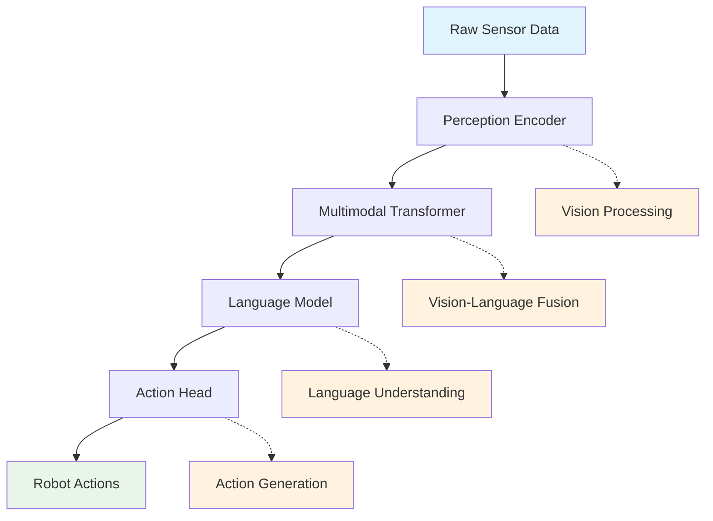

# VLA Systems (Vision–Language–Action)

## What is VLA?

Vision-Language-Action (VLA) systems represent a paradigm in robotics where visual perception, natural language understanding, and physical action are tightly integrated into a unified framework. Unlike traditional approaches where these components operate separately, VLA systems process visual input, interpret language commands, and generate appropriate actions in an end-to-end manner.

### Core Components of VLA Systems:

1. **Vision Processing**: Understanding the visual environment
2. **Language Understanding**: Interpreting natural language commands
3. **Action Generation**: Planning and executing physical actions
4. **Embodied Learning**: Learning from interaction with the physical world

### Key Characteristics:

- **Multimodal Integration**: Seamless fusion of visual, linguistic, and action modalities
- **End-to-End Learning**: Training models to map directly from perception to action
- **Embodied Intelligence**: Learning that occurs through physical interaction
- **Real-time Processing**: Fast inference for responsive robotic behavior

## Combining vision + language + action

The integration of vision, language, and action in VLA systems creates synergistic capabilities that exceed the sum of individual components.

### Vision-Language Integration

Vision and language are combined through:

- **Visual Grounding**: Associating language terms with visual objects and concepts
- **Scene Understanding**: Interpreting visual scenes in the context of language
- **Referential Expressions**: Understanding phrases like "the red box on the left"

### Language-Action Integration

Language and action are connected through:

- **Command Interpretation**: Mapping natural language to action sequences
- **Task Planning**: Decomposing high-level commands into executable steps
- **Feedback Integration**: Using action outcomes to refine understanding

### Vision-Action Integration

Visual perception guides action through:

- **Object Recognition**: Identifying targets for manipulation
- **Spatial Reasoning**: Understanding positions, orientations, and relationships
- **State Estimation**: Tracking the state of the environment and robot

### Unified Architecture Example

## Benchmark models

Several benchmark models have emerged as foundational approaches to VLA systems:

### RT-1 (Robotics Transformer 1)

Developed by Google, RT-1 is a transformer-based model that maps vision and language inputs directly to robot actions.

#### Key Features:
- **Transformer Architecture**: Uses attention mechanisms for multimodal fusion
- **Language Conditioned**: Actions are conditioned on natural language commands
- **Cross-Embodiment**: Can transfer learned behaviors across different robot platforms
- **Offline Training**: Trained on large-scale robot datasets

#### Architecture:
- Visual encoder processes camera images
- Language encoder processes text commands
- Transformer fuses multimodal information
- Action head generates robot commands

### BC-Z (Behavior Cloning with Z-axis)

BC-Z focuses on learning manipulation skills from human demonstrations with particular attention to end-effector orientation.

#### Key Features:
- **Human Demonstrations**: Learning from expert human teleoperation
- **Z-axis Focus**: Special handling of vertical movements
- **Imitation Learning**: Behavior cloning approach
- **Multi-task**: Can perform multiple manipulation tasks

### QT-Opt

A Q-learning approach for robotic manipulation with visual inputs.

#### Key Features:
- **Reinforcement Learning**: Uses Q-learning for policy optimization
- **Visual Foresight**: Predicts future visual states
- **Grasping Focus**: Specialized for object grasping tasks
- **Real-world Training**: Trained on physical robots

### Diffusion Policy

Recent approach using diffusion models for robotic policy learning.

#### Key Features:
- **Diffusion Models**: Uses denoising diffusion for action generation
- **Temporal Reasoning**: Models action sequences as trajectories
- **Robustness**: More robust to distribution shifts
- **Flexibility**: Can handle diverse manipulation tasks

## Multi-modal perception

Multi-modal perception in VLA systems involves processing and integrating information from multiple sensory modalities to form a comprehensive understanding of the environment.

### Visual Modalities

- **RGB Cameras**: Color information for object recognition
- **Depth Sensors**: Spatial information for 3D understanding
- **Thermal Cameras**: Temperature information for specialized tasks
- **Event Cameras**: High-speed motion detection

### Tactile and Proprioceptive Modalities

- **Force/Torque Sensors**: Feedback during manipulation
- **Tactile Sensors**: Fine-grained touch information
- **Joint Encoders**: Robot configuration feedback
- **IMU Data**: Robot orientation and motion

### Audio Modalities

- **Microphones**: Sound source localization
- **Speech Recognition**: Voice command processing
- **Environmental Sound**: Context awareness

### Fusion Strategies

#### Early Fusion
- Combine raw sensory data before processing
- Allows for cross-modal correlations to emerge naturally
- Computationally expensive

#### Late Fusion
- Process modalities separately, combine at decision level
- Computationally efficient
- May miss cross-modal correlations

#### Hierarchical Fusion
- Combine modalities at multiple levels of abstraction
- Balances efficiency with integration
- More complex architecture

## Applications in Robotics

VLA systems have numerous applications across different robotic domains:

### Household Robotics

- **Command Following**: "Clean the kitchen table"
- **Object Manipulation**: Picking up specific items
- **Navigation**: Moving to specified locations
- **Task Sequencing**: Completing multi-step chores

### Industrial Robotics

- **Quality Control**: Visual inspection with language feedback
- **Assembly Tasks**: Following verbal instructions
- **Maintenance**: Performing tasks based on natural language descriptions
- **Collaboration**: Working alongside humans with verbal communication

### Healthcare Robotics

- **Assistive Tasks**: Helping patients with daily activities
- **Medication Management**: Following complex medication schedules
- **Companionship**: Engaging in natural conversations
- **Therapy**: Guiding patients through exercises

### Educational Robotics

- **Interactive Learning**: Responding to student questions
- **Demonstration**: Performing actions based on educational content
- **Tutoring**: Providing feedback on student activities
- **Accessibility**: Assisting students with special needs

## Challenges and Limitations

Despite their potential, VLA systems face several challenges:

### Technical Challenges

- **Real-time Performance**: Balancing computational complexity with response time
- **Robustness**: Handling diverse and unexpected real-world scenarios
- **Safety**: Ensuring safe operation during learning and execution
- **Scalability**: Generalizing across diverse environments and tasks

### Data Requirements

- **Large Datasets**: Need for extensive multimodal training data
- **Diverse Scenarios**: Coverage of varied real-world situations
- **Annotation**: Expensive annotation of visual, linguistic, and action data
- **Embodiment Gap**: Difference between training and deployment environments

### Integration Complexity

- **Sensor Fusion**: Combining multiple sensory inputs effectively
- **Action Space**: Mapping high-level commands to low-level robot controls
- **Temporal Coordination**: Synchronizing perception and action over time
- **Embodiment Learning**: Learning that transfers across different robot platforms

## Future Directions

The field of VLA systems is rapidly evolving with several promising directions:

### Improved Architectures

- **Foundation Models**: Large-scale pre-trained models for robotics
- **Embodied GPT**: Language models specifically designed for embodied tasks
- **Neural-Symbolic Integration**: Combining neural learning with symbolic reasoning

### Learning Approaches

- **Offline Reinforcement Learning**: Learning from large datasets without online interaction
- **Meta-Learning**: Learning to learn new tasks quickly
- **Self-Supervised Learning**: Learning without explicit supervision

### Real-world Deployment

- **Robustness Improvements**: Better handling of real-world variability
- **Safety Mechanisms**: Ensuring safe operation in human environments
- **Human-Robot Collaboration**: More natural interaction paradigms

## Conclusion

VLA systems represent a significant advancement in robotics, enabling robots to understand and respond to natural language commands while perceiving and acting in the physical world. By tightly integrating vision, language, and action, these systems can perform complex tasks that require understanding of both the environment and human intentions. While challenges remain in terms of robustness, safety, and scalability, ongoing research is addressing these limitations and bringing us closer to truly intelligent, embodied agents that can seamlessly interact with humans in natural environments.