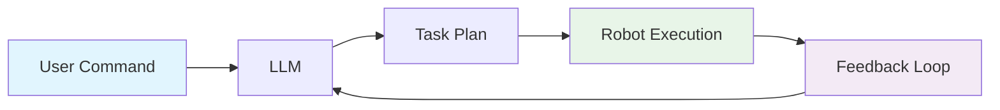

# Cognitive Planning with LLMs

## Using LLMs for instruction following

Large Language Models (LLMs) have revolutionized how robots can understand and follow complex instructions. Unlike traditional rule-based systems, LLMs can interpret natural language commands and generate appropriate robotic behaviors even for unseen tasks.

### LLM Capabilities for Robotics

LLMs bring several advantages to robotic instruction following:

1. **Natural Language Understanding**: Interpret commands in everyday language
2. **Context Awareness**: Understand instructions in the context of the current situation
3. **Common Sense Reasoning**: Apply general knowledge to interpret ambiguous instructions
4. **Generalization**: Handle novel tasks not explicitly programmed
5. **Multi-step Reasoning**: Break down complex tasks into executable steps

### LLM Integration Architecture

The integration of LLMs into robotic systems typically follows this architecture:



Here's a simplified implementation:

```python
import openai
import rospy
from std_msgs.msg import String
from geometry_msgs.msg import Pose
import json

class LLMRobotPlanner:
    def __init__(self, api_key):
        # Initialize OpenAI client
        openai.api_key = api_key
        
        # ROS initialization
        rospy.init_node('llm_robot_planner')
        self.command_pub = rospy.Publisher('/robot_commands', String, queue_size=10)
        self.status_sub = rospy.Subscriber('/robot_status', String, self.status_callback)
        
        # Robot state
        self.current_location = "unknown"
        self.robot_capabilities = self.get_robot_capabilities()
        
        # Task queue
        self.task_queue = []
        
    def get_robot_capabilities(self):
        # Define what the robot can do
        return [
            "navigation",
            "object_manipulation", 
            "speech",
            "object_detection",
            "grasping"
        ]
    
    def process_command(self, user_command):
        # Create a prompt that includes robot context
        prompt = self.create_contextual_prompt(user_command)
        
        try:
            # Call the LLM to generate a plan
            response = openai.ChatCompletion.create(
                model="gpt-3.5-turbo",  # or gpt-4 for better performance
                messages=[
                    {"role": "system", "content": self.get_system_prompt()},
                    {"role": "user", "content": prompt}
                ],
                temperature=0.1,  # Lower temperature for more consistent outputs
                functions=self.get_available_functions(),
                function_call="auto"
            )
            
            # Process the response
            message = response.choices[0].message
            
            if message.function_call:
                # Execute the function call
                function_name = message.function_call.name
                function_args = json.loads(message.function_call.arguments)
                return self.execute_function(function_name, function_args)
            else:
                # Handle text response
                return self.handle_text_response(message.content)
                
        except Exception as e:
            rospy.logerr(f"LLM error: {str(e)}")
            return {"error": str(e)}
    
    def create_contextual_prompt(self, user_command):
        # Include robot context in the prompt
        context = f"""
        Current robot location: {self.current_location}
        Robot capabilities: {', '.join(self.robot_capabilities)}
        Current time: {rospy.get_time()}
        
        User command: {user_command}
        
        Generate a plan for the robot to execute this command. If the command is unclear, ask for clarification.
        """
        return context
    
    def get_system_prompt(self):
        # Define the system behavior
        return """
        You are a helpful assistant that helps a robot understand and execute commands. 
        The robot has capabilities for navigation, object manipulation, speech, object detection, and grasping.
        Respond with function calls that represent actions the robot can take.
        """
    
    def get_available_functions(self):
        # Define functions the LLM can call
        return [
            {
                "name": "navigate_to",
                "description": "Navigate the robot to a specific location",
                "parameters": {
                    "type": "object",
                    "properties": {
                        "location": {"type": "string", "description": "The location to navigate to"},
                        "description": {"type": "string", "description": "Why navigating to this location"}
                    },
                    "required": ["location", "description"]
                }
            },
            {
                "name": "grasp_object",
                "description": "Grasp an object with the robot's manipulator",
                "parameters": {
                    "type": "object",
                    "properties": {
                        "object": {"type": "string", "description": "The object to grasp"},
                        "location": {"type": "string", "description": "Where the object is located"},
                        "description": {"type": "string", "description": "Why grasping this object"}
                    },
                    "required": ["object", "description"]
                }
            },
            {
                "name": "place_object",
                "description": "Place an object at a specific location",
                "parameters": {
                    "type": "object",
                    "properties": {
                        "location": {"type": "string", "description": "Where to place the object"},
                        "description": {"type": "string", "description": "Why placing at this location"}
                    },
                    "required": ["location", "description"]
                }
            },
            {
                "name": "detect_object",
                "description": "Detect if a specific object is present in the environment",
                "parameters": {
                    "type": "object",
                    "properties": {
                        "object": {"type": "string", "description": "The object to detect"},
                        "location": {"type": "string", "description": "Where to look for the object"},
                        "description": {"type": "string", "description": "Why detecting this object"}
                    },
                    "required": ["object", "description"]
                }
            },
            {
                "name": "speak",
                "description": "Make the robot speak a message",
                "parameters": {
                    "type": "object",
                    "properties": {
                        "message": {"type": "string", "description": "The message to speak"},
                        "reason": {"type": "string", "description": "Why speaking this message"}
                    },
                    "required": ["message", "reason"]
                }
            }
        ]
    
    def execute_function(self, function_name, function_args):
        # Execute the function and return result
        if function_name == "navigate_to":
            return self.execute_navigate_to(function_args)
        elif function_name == "grasp_object":
            return self.execute_grasp_object(function_args)
        elif function_name == "place_object":
            return self.execute_place_object(function_args)
        elif function_name == "detect_object":
            return self.execute_detect_object(function_args)
        elif function_name == "speak":
            return self.execute_speak(function_args)
        else:
            return {"error": f"Unknown function: {function_name}"}
    
    def execute_navigate_to(self, args):
        # Publish navigation command
        command = {
            "type": "navigate",
            "target": args["location"],
            "description": args["description"]
        }
        self.command_pub.publish(json.dumps(command))
        return {"status": "navigation_started", "target": args["location"]}
    
    def execute_grasp_object(self, args):
        # Publish grasping command
        command = {
            "type": "grasp",
            "object": args["object"],
            "location": args.get("location", self.current_location),
            "description": args["description"]
        }
        self.command_pub.publish(json.dumps(command))
        return {"status": "grasping_started", "object": args["object"]}
    
    def execute_place_object(self, args):
        # Publish placement command
        command = {
            "type": "place",
            "target": args["location"],
            "description": args["description"]
        }
        self.command_pub.publish(json.dumps(command))
        return {"status": "placement_started", "target": args["location"]}
    
    def execute_detect_object(self, args):
        # Publish detection command
        command = {
            "type": "detect",
            "object": args["object"],
            "location": args.get("location", self.current_location),
            "description": args["description"]
        }
        self.command_pub.publish(json.dumps(command))
        return {"status": "detection_started", "object": args["object"]}
    
    def execute_speak(self, args):
        # Publish speech command
        command = {
            "type": "speak",
            "message": args["message"],
            "reason": args["reason"]
        }
        self.command_pub.publish(json.dumps(command))
        return {"status": "speaking", "message": args["message"]}
    
    def handle_text_response(self, response_text):
        # Handle cases where the LLM returns text instead of function calls
        return {"response": response_text}
    
    def status_callback(self, status_msg):
        # Update robot state based on status messages
        try:
            status = json.loads(status_msg.data)
            if "location" in status:
                self.current_location = status["location"]
        except json.JSONDecodeError:
            rospy.logwarn("Could not parse status message")
    
    def run(self):
        # Main loop
        rospy.spin()

# Example usage
if __name__ == '__main__':
    planner = LLMRobotPlanner(api_key="your-openai-api-key")
    # planner.run()  # Uncomment to run the node
```

## Turning "Clean the room" into robot actions

Let's walk through how a complex command like "Clean the room" gets processed by an LLM-powered robotic system:

### Step 1: Command Interpretation

The LLM interprets the high-level command and breaks it down into subtasks:

```python
def interpret_clean_room_command():
    """
    Example of how "Clean the room" might be interpreted:
    
    1. Assess the current state of the room
    2. Identify items that need to be cleaned or organized
    3. Plan the cleaning sequence
    4. Execute cleaning actions
    """
    
    interpretation = {
        "command": "Clean the room",
        "decomposition": [
            {"action": "detect_objects", "target": "entire room", "reason": "Identify items that need attention"},
            {"action": "classify_objects", "target": "identified objects", "reason": "Determine which items need cleaning/organizing"},
            {"action": "plan_sequence", "target": "cleaning tasks", "reason": "Determine optimal order of operations"},
            {"action": "execute_cleaning", "target": "individual tasks", "reason": "Perform cleaning actions"}
        ]
    }
    return interpretation
```

### Step 2: Object Detection and Classification

The robot first needs to understand what's in the room:

```python
def detect_and_classify_room_objects():
    """
    Example function to detect and classify objects in a room
    """
    detected_objects = [
        {"name": "red cup", "category": "item_to_place", "location": "desk", "state": "out_of_place"},
        {"name": "blue pen", "category": "item_to_place", "location": "floor", "state": "out_of_place"},
        {"name": "trash", "category": "item_to_discard", "location": "desk", "state": "needs_removal"},
        {"name": "book", "category": "item_to_place", "location": "chair", "state": "out_of_place"},
        {"name": "dust", "category": "needs_cleaning", "location": "surface", "state": "dirty"}
    ]
    
    return detected_objects
```

### Step 3: Task Planning

Based on the detected objects, the LLM generates a sequence of actions:

```python
def generate_cleaning_plan(detected_objects):
    """
    Generate a cleaning plan based on detected objects
    """
    plan = []
    
    # First, collect items to discard
    trash_items = [obj for obj in detected_objects if obj["category"] == "item_to_discard"]
    for item in trash_items:
        plan.append({
            "action": "grasp_object",
            "target": item["name"],
            "location": item["location"],
            "next_action": "navigate_to",
            "next_target": "trash_bin"
        })
    
    # Then, organize misplaced items
    misplaced_items = [obj for obj in detected_objects if obj["category"] == "item_to_place"]
    for item in misplaced_items:
        # Determine appropriate location based on object type
        appropriate_location = get_appropriate_location(item["name"])
        plan.extend([
            {
                "action": "navigate_to",
                "target": item["location"]
            },
            {
                "action": "grasp_object", 
                "target": item["name"]
            },
            {
                "action": "navigate_to",
                "target": appropriate_location
            },
            {
                "action": "place_object",
                "target": appropriate_location
            }
        ])
    
    # Finally, clean surfaces if needed
    cleaning_needed = any(obj["category"] == "needs_cleaning" for obj in detected_objects)
    if cleaning_needed:
        plan.append({
            "action": "clean_surfaces",
            "target": "room_surfaces"
        })
    
    return plan

def get_appropriate_location(object_name):
    """
    Determine appropriate location for an object based on its type
    """
    location_map = {
        "cup": "kitchen_counter",
        "pen": "desk_drawer", 
        "book": "bookshelf",
        "plate": "kitchen_counter"
    }
    
    for obj_type, location in location_map.items():
        if obj_type in object_name.lower():
            return location
    
    return "storage_area"  # default location
```

### Step 4: Execution with Monitoring

The robot executes the plan while monitoring for changes:

```python
class CleaningExecutor:
    def __init__(self):
        self.current_task_index = 0
        self.plan = []
        self.monitoring = True
        
    def execute_cleaning_plan(self, plan):
        self.plan = plan
        self.current_task_index = 0
        
        while self.current_task_index < len(self.plan) and self.monitoring:
            current_task = self.plan[self.current_task_index]
            
            # Execute the current task
            result = self.execute_task(current_task)
            
            if result["success"]:
                rospy.loginfo(f"Completed task: {current_task['action']}")
                self.current_task_index += 1
            else:
                rospy.logerr(f"Failed task: {current_task['action']}, error: {result.get('error')}")
                # Handle failure - maybe skip, retry, or ask for help
                self.handle_task_failure(current_task, result)
    
    def execute_task(self, task):
        # Execute a single task based on its type
        if task["action"] == "navigate_to":
            return self.navigate_to_location(task["target"])
        elif task["action"] == "grasp_object":
            return self.grasp_object(task["target"])
        elif task["action"] == "place_object":
            return self.place_object(task["target"])
        elif task["action"] == "clean_surfaces":
            return self.clean_surfaces()
        else:
            return {"success": False, "error": f"Unknown action: {task['action']}"}
    
    def handle_task_failure(self, task, result):
        # Implement failure handling logic
        rospy.logwarn(f"Handling failure for task: {task}")
        
        # Options:
        # 1. Skip to next task
        # 2. Retry current task
        # 3. Ask for human assistance
        # 4. Abort the entire plan
        self.current_task_index += 1  # For now, just skip to next task
```

## Task decomposition

Task decomposition is a critical capability of LLMs in robotic planning. It involves breaking down high-level goals into sequences of low-level, executable actions.

### Hierarchical Task Decomposition

LLMs can decompose tasks at multiple levels:

```python
class TaskDecomposer:
    def __init__(self):
        self.decomposition_templates = {
            "clean_room": [
                "survey_environment",
                "identify_objects",
                "classify_objects",
                "plan_sequence",
                "execute_actions",
                "verify_completion"
            ],
            "prepare_meal": [
                "identify_ingredients", 
                "locate_ingredients",
                "transport_ingredients",
                "prepare_ingredients",
                "cook_food",
                "serve_food"
            ],
            "organize_office": [
                "scan_area",
                "identify_items",
                "categorize_items",
                "determine_destinations",
                "transport_items",
                "arrange_items"
            ]
        }
    
    def decompose_task(self, high_level_task):
        """
        Decompose a high-level task into subtasks
        """
        # Check if we have a template for this task
        if high_level_task in self.decomposition_templates:
            return self.decomposition_templates[high_level_task]
        
        # If no template, use LLM to generate decomposition
        return self.llm_decompose_task(high_level_task)
    
    def llm_decompose_task(self, task_description):
        """
        Use LLM to decompose an unfamiliar task
        """
        prompt = f"""
        Decompose the following high-level task into a sequence of 5-10 specific, actionable subtasks:
        Task: {task_description}
        
        Return the subtasks as a numbered list.
        """
        
        # In practice, this would call the LLM API
        # For this example, we'll return a mock response
        mock_decomposition = [
            "survey the area to understand the current state",
            "identify specific objects that need attention", 
            "determine the appropriate actions for each object",
            "plan the sequence of actions to maximize efficiency",
            "execute the planned actions",
            "verify that the task has been completed successfully"
        ]
        
        return mock_decomposition
    
    def refine_subtask(self, subtask):
        """
        Further decompose a subtask if needed
        """
        # Example refinement for "locate_ingredients"
        if "locate" in subtask.lower():
            return [
                f"scan environment for {subtask.split()[-1]}",
                f"identify specific {subtask.split()[-1]} items",
                f"check accessibility of {subtask.split()[-1]} items",
                f"determine approach path to {subtask.split()[-1]} items"
            ]
        
        return [subtask]  # Return as single step if no refinement needed
```

### Context-Aware Decomposition

LLMs can decompose tasks based on context and constraints:

```python
def contextual_task_decomposition(task, context):
    """
    Decompose a task considering the current context
    """
    prompt = f"""
    Decompose the following task considering the provided context:
    
    Task: {task}
    
    Context:
    - Environment: {context.get('environment', 'unknown')}
    - Available tools: {context.get('tools', 'none specified')}
    - Constraints: {context.get('constraints', 'none specified')}
    - Current state: {context.get('state', 'unknown')}
    - Safety requirements: {context.get('safety', 'standard')}
    
    Provide a detailed sequence of specific, executable subtasks.
    Consider safety, efficiency, and the available tools in your decomposition.
    """
    
    # In practice, this would call the LLM API
    # For this example, we'll return a context-aware decomposition
    if "fragile" in context.get("constraints", ""):
        return [
            f"assess {task} for fragile items",
            f"plan gentle handling approach for fragile items",
            f"execute {task} with extra care for fragile items",
            f"verify fragile items remain intact"
        ]
    
    return [
        f"assess current state for {task}",
        f"plan approach for {task}",
        f"execute {task}",
        f"verify completion of {task}"
    ]
```

## Integrating GPT with ROS 2

Integrating GPT models with ROS 2 requires creating nodes that can communicate with the LLM API and translate responses into ROS 2 messages.

### ROS 2 LLM Node Implementation

```python
import rclpy
from rclpy.node import Node
from std_msgs.msg import String
from geometry_msgs.msg import Pose
import openai
import json
from functools import partial

class LLMPlannerNode(Node):
    def __init__(self):
        super().__init__('llm_planner_node')
        
        # Declare parameters
        self.declare_parameter('openai_api_key', '')
        self.declare_parameter('model', 'gpt-3.5-turbo')
        
        # Get parameters
        api_key = self.get_parameter('openai_api_key').value
        if api_key:
            openai.api_key = api_key
        
        self.model = self.get_parameter('model').value
        
        # Create subscribers and publishers
        self.command_sub = self.create_subscription(
            String,
            'high_level_commands',
            self.command_callback,
            10
        )
        
        self.action_pub = self.create_publisher(
            String,
            'robot_actions',
            10
        )
        
        self.status_pub = self.create_publisher(
            String,
            'planner_status',
            10
        )
        
        # Robot state
        self.robot_state = {
            'location': 'unknown',
            'battery': 100,
            'gripper': 'open',
            'current_task': 'idle'
        }
        
        self.get_logger().info('LLM Planner Node initialized')
    
    def command_callback(self, msg):
        """
        Callback for high-level commands
        """
        command = msg.data
        self.get_logger().info(f'Received command: {command}')
        
        # Update status
        status_msg = String()
        status_msg.data = json.dumps({
            'status': 'processing',
            'command': command,
            'timestamp': self.get_clock().now().to_msg()
        })
        self.status_pub.publish(status_msg)
        
        # Process command in a separate thread to avoid blocking
        future = self.process_command_async(command)
        # In a real implementation, you would handle the future properly
    
    def process_command_async(self, command):
        """
        Process command using LLM and execute resulting actions
        """
        try:
            # Create contextual prompt
            prompt = self.create_contextual_prompt(command)
            
            # Call LLM
            response = openai.ChatCompletion.create(
                model=self.model,
                messages=[
                    {"role": "system", "content": self.get_system_prompt()},
                    {"role": "user", "content": prompt}
                ],
                temperature=0.1,
                functions=self.get_available_functions(),
                function_call="auto"
            )
            
            # Process response
            message = response.choices[0].message
            
            if message.function_call:
                function_name = message.function_call.name
                function_args = json.loads(message.function_call.arguments)
                
                # Execute the function
                result = self.execute_function(function_name, function_args)
                
                # Publish resulting actions
                if result.get('actions'):
                    for action in result['actions']:
                        action_msg = String()
                        action_msg.data = json.dumps(action)
                        self.action_pub.publish(action_msg)
                
                # Update status
                status_msg = String()
                status_msg.data = json.dumps({
                    'status': 'completed',
                    'command': command,
                    'result': result,
                    'timestamp': self.get_clock().now().to_msg()
                })
                self.status_pub.publish(status_msg)
            
            return result
            
        except Exception as e:
            self.get_logger().error(f'Error processing command: {str(e)}')
            
            # Update status with error
            status_msg = String()
            status_msg.data = json.dumps({
                'status': 'error',
                'command': command,
                'error': str(e),
                'timestamp': self.get_clock().now().to_msg()
            })
            self.status_pub.publish(status_msg)
            
            return {'error': str(e)}
    
    def create_contextual_prompt(self, command):
        """
        Create a prompt that includes robot context
        """
        return f"""
        You are a helpful assistant for a mobile manipulator robot. The robot has the following capabilities:
        - Navigation to named locations
        - Object detection and recognition
        - Grasping and manipulation of objects
        - Speech output
        
        Current robot state:
        - Location: {self.robot_state['location']}
        - Battery level: {self.robot_state['battery']}%
        - Gripper state: {self.robot_state['gripper']}
        - Current task: {self.robot_state['current_task']}
        
        User command: {command}
        
        Generate a plan for the robot to execute this command using the available functions.
        """
    
    def get_system_prompt(self):
        """
        Get the system prompt for the LLM
        """
        return """
        You are a helpful assistant that helps a robot understand and execute commands. 
        Respond with function calls that represent actions the robot can take.
        Only use the functions provided.
        """
    
    def get_available_functions(self):
        """
        Define the functions available to the LLM
        """
        return [
            {
                "name": "navigate_to",
                "description": "Navigate the robot to a specific location",
                "parameters": {
                    "type": "object",
                    "properties": {
                        "location": {"type": "string", "description": "The location to navigate to"},
                        "reason": {"type": "string", "description": "Why navigating to this location"}
                    },
                    "required": ["location", "reason"]
                }
            },
            {
                "name": "detect_object",
                "description": "Detect if a specific object is present in the environment",
                "parameters": {
                    "type": "object",
                    "properties": {
                        "object": {"type": "string", "description": "The object to detect"},
                        "location": {"type": "string", "description": "Where to look for the object (optional)"},
                        "reason": {"type": "string", "description": "Why detecting this object"}
                    },
                    "required": ["object", "reason"]
                }
            },
            {
                "name": "grasp_object",
                "description": "Grasp an object with the robot's manipulator",
                "parameters": {
                    "type": "object",
                    "properties": {
                        "object": {"type": "string", "description": "The object to grasp"},
                        "location": {"type": "string", "description": "Where the object is located (optional)"},
                        "reason": {"type": "string", "description": "Why grasping this object"}
                    },
                    "required": ["object", "reason"]
                }
            },
            {
                "name": "place_object",
                "description": "Place an object at a specific location",
                "parameters": {
                    "type": "object",
                    "properties": {
                        "location": {"type": "string", "description": "Where to place the object"},
                        "reason": {"type": "string", "description": "Why placing at this location"}
                    },
                    "required": ["location", "reason"]
                }
            },
            {
                "name": "speak",
                "description": "Make the robot speak a message",
                "parameters": {
                    "type": "object",
                    "properties": {
                        "message": {"type": "string", "description": "The message to speak"},
                        "reason": {"type": "string", "description": "Why speaking this message"}
                    },
                    "required": ["message", "reason"]
                }
            }
        ]
    
    def execute_function(self, function_name, function_args):
        """
        Execute a function and return the resulting actions
        """
        if function_name == "navigate_to":
            return self.execute_navigate_to(function_args)
        elif function_name == "detect_object":
            return self.execute_detect_object(function_args)
        elif function_name == "grasp_object":
            return self.execute_grasp_object(function_args)
        elif function_name == "place_object":
            return self.execute_place_object(function_args)
        elif function_name == "speak":
            return self.execute_speak(function_args)
        else:
            return {"error": f"Unknown function: {function_name}"}
    
    def execute_navigate_to(self, args):
        """
        Execute navigation action
        """
        action = {
            "type": "navigation",
            "target_location": args["location"],
            "reason": args["reason"]
        }
        
        # Update robot state
        self.robot_state['current_task'] = f'navigating to {args["location"]}'
        
        return {"actions": [action]}
    
    def execute_detect_object(self, args):
        """
        Execute object detection action
        """
        action = {
            "type": "object_detection",
            "target_object": args["object"],
            "location": args.get("location", "current"),
            "reason": args["reason"]
        }
        
        return {"actions": [action]}
    
    def execute_grasp_object(self, args):
        """
        Execute grasping action
        """
        action = {
            "type": "grasp",
            "target_object": args["object"],
            "location": args.get("location", "current"),
            "reason": args["reason"]
        }
        
        # Update robot state
        self.robot_state['gripper'] = 'closed'
        
        return {"actions": [action]}
    
    def execute_place_object(self, args):
        """
        Execute placement action
        """
        action = {
            "type": "place",
            "target_location": args["location"],
            "reason": args["reason"]
        }
        
        # Update robot state
        self.robot_state['gripper'] = 'open'
        
        return {"actions": [action]}
    
    def execute_speak(self, args):
        """
        Execute speech action
        """
        action = {
            "type": "speak",
            "message": args["message"],
            "reason": args["reason"]
        }
        
        return {"actions": [action]}

def main(args=None):
    rclpy.init(args=args)
    
    llm_planner_node = LLMPlannerNode()
    
    try:
        rclpy.spin(llm_planner_node)
    except KeyboardInterrupt:
        pass
    finally:
        llm_planner_node.destroy_node()
        rclpy.shutdown()

if __name__ == '__main__':
    main()
```

### Launch File for LLM Integration

```python
# launch/llm_planner.launch.py
from launch import LaunchDescription
from launch_ros.actions import Node
from launch.substitutions import LaunchConfiguration
from launch.actions import DeclareLaunchArgument

def generate_launch_description():
    return LaunchDescription([
        # Declare launch arguments
        DeclareLaunchArgument(
            'openai_api_key',
            default_value='',
            description='OpenAI API key for LLM access'
        ),
        
        DeclareLaunchArgument(
            'model',
            default_value='gpt-3.5-turbo',
            description='LLM model to use'
        ),
        
        # LLM Planner Node
        Node(
            package='llm_robot_planning',
            executable='llm_planner_node',
            name='llm_planner',
            parameters=[
                {
                    'openai_api_key': LaunchConfiguration('openai_api_key'),
                    'model': LaunchConfiguration('model')
                }
            ],
            remappings=[
                ('high_level_commands', 'voice_commands'),
                ('robot_actions', 'low_level_commands')
            ]
        )
    ])
```

## Safety and Validation

When integrating LLMs with robotic systems, safety and validation are paramount:

### Safety Validation Layer

```python
class SafetyValidator:
    def __init__(self):
        self.forbidden_actions = [
            "harm", "injure", "damage", "destroy", "attack", "hit"
        ]
        self.safe_locations = ["designated_area", "workspace", "lab"]
        self.max_plan_length = 50  # Prevent extremely long plans
        
    def validate_plan(self, plan, context):
        """
        Validate a plan generated by an LLM for safety
        """
        # Check for forbidden language in the plan
        plan_text = json.dumps(plan, indent=2)
        for forbidden in self.forbidden_actions:
            if forbidden.lower() in plan_text.lower():
                return {
                    "valid": False,
                    "reason": f"Plan contains forbidden action: {forbidden}",
                    "safe_action": "abort"
                }
        
        # Check plan length
        if len(plan) > self.max_plan_length:
            return {
                "valid": False,
                "reason": f"Plan too long: {len(plan)} steps (max: {self.max_plan_length})",
                "safe_action": "request_simplification"
            }
        
        # Check for unsafe locations
        for action in plan:
            if action.get("type") == "navigation":
                target = action.get("target_location", "")
                if target not in self.safe_locations:
                    return {
                        "valid": False,
                        "reason": f"Navigation to unsafe location: {target}",
                        "safe_action": "request_alternative"
                    }
        
        # Check for physically impossible actions
        if self.check_physical_constraints(plan, context):
            return {
                "valid": False,
                "reason": "Plan contains physically impossible actions",
                "safe_action": "request_revision"
            }
        
        return {"valid": True, "safe_action": "proceed"}
    
    def check_physical_constraints(self, plan, context):
        """
        Check if the plan violates physical constraints of the robot
        """
        # Example: Check if robot is asked to carry more than its capacity
        for i, action in enumerate(plan):
            if action.get("type") == "grasp":
                # In a real system, you would check object weight vs robot capacity
                pass
        
        return False  # No violations found
```

## Challenges and Considerations

### Computational Requirements

LLM integration requires significant computational resources:

- **Cloud-based**: Requires internet connection, potential latency
- **Edge-based**: Requires powerful local hardware, may be expensive
- **Hybrid**: Balance between responsiveness and computational load

### Reliability Concerns

- **API availability**: Dependence on external services
- **Consistency**: LLMs may generate different responses to similar inputs
- **Error handling**: Robust error handling for unexpected outputs

### Safety and Ethics

- **Validation**: All LLM outputs must be validated before execution
- **Monitoring**: Continuous monitoring of robot behavior
- **Fallbacks**: Safe fallback behaviors when LLM fails

## Conclusion

Cognitive planning with LLMs represents a paradigm shift in robotics, enabling robots to understand and execute complex, natural language commands. By leveraging the reasoning capabilities of large language models, robots can interpret high-level goals, decompose them into executable tasks, and adapt to novel situations.

However, successful integration requires careful consideration of safety, validation, and computational requirements. The combination of LLMs with traditional robotic systems creates powerful platforms capable of complex, human-like reasoning while maintaining the precision and reliability required for physical interaction.

As LLM technology continues to advance, we can expect even more sophisticated cognitive capabilities in robotic systems, leading to more intuitive and capable human-robot interaction.