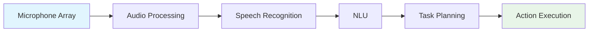

# Capstone: Autonomous Humanoid

## Receive voice command

Creating an autonomous humanoid robot that can receive and interpret voice commands is the culmination of all the technologies we've explored. This involves integrating speech recognition, natural language understanding, and robotic execution in a seamless pipeline.

### Voice Command Architecture

The architecture for receiving and processing voice commands in an autonomous humanoid includes several components:



Let's examine each component in detail:

### Audio Processing and Capture

For a humanoid robot, audio processing must account for the robot's movement and potential noise from actuators:

```python
import numpy as np
import pyaudio
import webrtcvad
from collections import deque
import threading

class AudioProcessor:
    def __init__(self):
        # Audio configuration
        self.rate = 16000  # Sample rate
        self.chunk_size = 1024  # Samples per chunk
        self.channels = 1  # Mono
        self.format = pyaudio.paInt16  # 16-bit samples
        
        # Voice activity detection
        self.vad = webrtcvad.Vad(2)  # Aggressiveness mode 2
        
        # Audio buffer for processing
        self.audio_buffer = deque(maxlen=100)  # Store last 100 chunks
        
        # Initialize PyAudio
        self.audio = pyaudio.PyAudio()
        
        # Start audio stream
        self.stream = self.audio.open(
            format=self.format,
            channels=self.channels,
            rate=self.rate,
            input=True,
            frames_per_buffer=self.chunk_size,
            stream_callback=self.audio_callback
        )
        
        self.is_listening = True
        self.command_queue = deque()
        
    def audio_callback(self, in_data, frame_count, time_info, status):
        """Callback function for audio stream"""
        # Convert raw audio data to numpy array
        audio_data = np.frombuffer(in_data, dtype=np.int16)
        
        # Store in buffer
        self.audio_buffer.append(audio_data)
        
        # Check for voice activity
        if self.is_voice_active(audio_data):
            # Add to command processing queue
            self.command_queue.append(audio_data)
        
        return (None, pyaudio.paContinue)
    
    def is_voice_active(self, audio_data):
        """Check if voice is active in the audio chunk"""
        # Convert to bytes for VAD
        audio_bytes = audio_data.tobytes()
        
        # Check for voice activity (requires 20ms chunks for WebRTC VAD)
        try:
            # WebRTC VAD requires specific frame sizes (10, 20, or 30 ms)
            frame_size = int(self.rate * 0.02)  # 20ms frame
            frames = [audio_bytes[i:i+frame_size*2] for i in range(0, len(audio_bytes), frame_size*2)]
            
            voice_frames = 0
            for frame in frames:
                if len(frame) == frame_size * 2:  # Ensure proper frame size
                    if self.vad.is_speech(frame, self.rate):
                        voice_frames += 1
            
            # Consider voice active if more than 30% of frames have speech
            return voice_frames / len(frames) > 0.3 if frames else False
        except:
            return False
    
    def get_command_audio(self):
        """Get accumulated audio for a command"""
        if not self.command_queue:
            return None
        
        # Combine multiple chunks for a single command
        command_audio = np.concatenate(list(self.command_queue))
        self.command_queue.clear()
        
        return command_audio
    
    def start_listening(self):
        """Start the audio processing loop"""
        self.stream.start_stream()
    
    def stop_listening(self):
        """Stop the audio processing loop"""
        self.stream.stop_stream()
        self.stream.close()
        self.audio.terminate()
```

### Speech Recognition Integration

Integrating Whisper for speech recognition in the humanoid:

```python
import whisper
import torch
import numpy as np

class SpeechRecognizer:
    def __init__(self, model_size="base.en"):
        # Load Whisper model
        self.model = whisper.load_model(model_size)
        
        # Check for GPU availability
        self.device = "cuda" if torch.cuda.is_available() else "cpu"
        if self.device == "cuda":
            self.model = self.model.to(self.device)
    
    def transcribe_audio(self, audio_data):
        """Transcribe audio data to text using Whisper"""
        # Convert audio to float32 numpy array
        if isinstance(audio_data, np.ndarray):
            audio_array = audio_data.astype(np.float32)
        else:
            # Assume it's bytes that need conversion
            audio_array = np.frombuffer(audio_data, dtype=np.int16).astype(np.float32)
            audio_array /= 32768.0  # Normalize to [-1, 1]
        
        # Transcribe using Whisper
        result = self.model.transcribe(audio_array)
        return result["text"].strip()
    
    def transcribe_with_timestamps(self, audio_data):
        """Transcribe audio with word-level timestamps"""
        # Convert audio to float32 numpy array
        if isinstance(audio_data, np.ndarray):
            audio_array = audio_data.astype(np.float32)
        else:
            audio_array = np.frombuffer(audio_data, dtype=np.int16).astype(np.float32)
            audio_array /= 32768.0  # Normalize to [-1, 1]
        
        # Use Whisper's token timestamps for more detailed output
        result = self.model.transcribe(audio_array, word_timestamps=True)
        return result
```

### Voice Command Processing Pipeline

Now let's create the complete pipeline for processing voice commands:

```python
import rospy
from std_msgs.msg import String
from geometry_msgs.msg import Pose
import json
import time

class VoiceCommandProcessor:
    def __init__(self):
        # Initialize ROS node
        rospy.init_node('voice_command_processor')
        
        # Initialize audio and speech recognition
        self.audio_processor = AudioProcessor()
        self.speech_recognizer = SpeechRecognizer()
        
        # ROS publishers and subscribers
        self.command_pub = rospy.Publisher('/high_level_commands', String, queue_size=10)
        self.status_pub = rospy.Publisher('/voice_system_status', String, queue_size=10)
        
        # Robot state
        self.robot_state = {
            'location': 'unknown',
            'battery': 100,
            'gripper': 'open',
            'current_task': 'idle',
            'last_command_time': 0
        }
        
        # Command processing state
        self.is_processing = False
        self.command_timeout = 5.0  # seconds
        
        # Start audio processing
        self.audio_processor.start_listening()
        
        rospy.loginfo("Voice Command Processor initialized")
    
    def process_voice_commands(self):
        """Main loop for processing voice commands"""
        rate = rospy.Rate(10)  # 10 Hz
        
        while not rospy.is_shutdown():
            # Check for new audio commands
            audio_data = self.audio_processor.get_command_audio()
            
            if audio_data is not None and len(audio_data) > 0:
                # Process the command
                self.process_single_command(audio_data)
            
            rate.sleep()
    
    def process_single_command(self, audio_data):
        """Process a single voice command"""
        if self.is_processing:
            rospy.logwarn("Still processing previous command, ignoring new audio")
            return
        
        self.is_processing = True
        
        try:
            # Update status
            self.publish_status("processing_audio")
            
            # Transcribe the audio
            rospy.loginfo("Transcribing audio...")
            command_text = self.speech_recognizer.transcribe_audio(audio_data)
            
            if not command_text:
                rospy.logwarn("No text transcribed from audio")
                self.is_processing = False
                return
            
            rospy.loginfo(f"Transcribed command: {command_text}")
            
            # Validate the command
            if self.is_valid_command(command_text):
                # Publish the command for higher-level processing
                command_msg = String()
                command_msg.data = command_text
                self.command_pub.publish(command_msg)
                
                # Update robot state
                self.robot_state['last_command_time'] = rospy.get_time()
                self.robot_state['current_task'] = f'processing: {command_text[:50]}...'
                
                # Update status
                self.publish_status("command_processed", {"command": command_text})
            else:
                rospy.logwarn(f"Invalid command detected: {command_text}")
                self.publish_status("invalid_command", {"command": command_text})
        
        except Exception as e:
            rospy.logerr(f"Error processing voice command: {str(e)}")
            self.publish_status("error", {"error": str(e)})
        
        finally:
            self.is_processing = False
    
    def is_valid_command(self, command_text):
        """Validate if the transcribed text is a valid command"""
        # Basic validation - check if it's not empty and has reasonable length
        if not command_text or len(command_text.strip()) < 3:
            return False
        
        # Check for common non-command phrases that might be transcribed
        non_commands = [
            "um", "uh", "hmm", "okay", "yes", "no", "hello", "hi",
            "thank you", "thanks", "please", "sorry"
        ]
        
        # If it's just a non-command word, it's probably not a real command
        words = command_text.lower().strip().split()
        if len(words) == 1 and words[0] in non_commands:
            return False
        
        # If it contains command-related words, it's likely valid
        command_indicators = [
            "go", "move", "navigate", "pick", "grasp", "place", "put", 
            "take", "get", "bring", "find", "look", "see", "show", "tell"
        ]
        
        for word in words:
            if word in command_indicators:
                return True
        
        # If it doesn't have clear indicators but seems like a reasonable sentence, accept it
        return len(words) >= 2
    
    def publish_status(self, status, data=None):
        """Publish status updates"""
        status_msg = {
            'status': status,
            'timestamp': rospy.get_time(),
            'robot_state': self.robot_state.copy()
        }
        
        if data:
            status_msg.update(data)
        
        status_ros_msg = String()
        status_ros_msg.data = json.dumps(status_msg)
        self.status_pub.publish(status_ros_msg)
    
    def shutdown(self):
        """Clean shutdown"""
        self.audio_processor.stop_listening()
        rospy.loginfo("Voice Command Processor shut down")

# Example usage
def main():
    processor = VoiceCommandProcessor()
    
    try:
        processor.process_voice_commands()
    except KeyboardInterrupt:
        rospy.loginfo("Shutting down voice command processor...")
        processor.shutdown()

if __name__ == '__main__':
    main()
```

## Plan task

Once a voice command is received, the autonomous humanoid must plan the task. This involves breaking down the high-level command into executable steps using LLMs and traditional planning algorithms.

### Task Planning Architecture

```python
import openai
import json
from typing import List, Dict, Any
import rospy

class TaskPlanner:
    def __init__(self, api_key):
        openai.api_key = api_key
        
        # ROS initialization
        rospy.init_node('task_planner')
        
        # Robot capabilities and environment knowledge
        self.robot_capabilities = {
            "navigation": True,
            "manipulation": True,
            "speech": True,
            "object_detection": True,
            "grasping": True
        }
        
        self.known_locations = {
            "kitchen": {"x": 1.0, "y": 2.0, "description": "Area with appliances and food"},
            "living_room": {"x": 5.0, "y": 3.0, "description": "Main seating area"},
            "bedroom": {"x": 8.0, "y": 1.0, "description": "Sleeping area"},
            "office": {"x": 3.0, "y": 6.0, "description": "Work area"},
            "charging_station": {"x": 0.0, "y": 0.0, "description": "Robot charging location"}
        }
        
        self.known_objects = {
            "red_cup": {"type": "drinkware", "location": "kitchen_counter", "graspable": True},
            "blue_pen": {"type": "writing", "location": "office_desk", "graspable": True},
            "book": {"type": "reading", "location": "living_room_shelf", "graspable": True},
            "apple": {"type": "food", "location": "kitchen_counter", "graspable": True}
        }
        
        # Task execution state
        self.current_task_plan = []
        self.current_step = 0
    
    def plan_task(self, command: str, robot_state: Dict[str, Any]) -> List[Dict[str, Any]]:
        """
        Plan a task based on the command and current robot state
        """
        # Create a contextual prompt for the LLM
        prompt = self.create_planning_prompt(command, robot_state)
        
        try:
            # Call the LLM to generate a plan
            response = openai.ChatCompletion.create(
                model="gpt-3.5-turbo",
                messages=[
                    {"role": "system", "content": self.get_planning_system_prompt()},
                    {"role": "user", "content": prompt}
                ],
                temperature=0.1,
                functions=self.get_planning_functions(),
                function_call="auto"
            )
            
            # Process the response
            message = response.choices[0].message
            
            if message.function_call:
                function_name = message.function_call.name
                function_args = json.loads(message.function_call.arguments)
                
                if function_name == "generate_task_plan":
                    return self.validate_and_format_plan(function_args["plan"])
                else:
                    rospy.logwarn(f"Unexpected function call: {function_name}")
                    return []
            else:
                # If no function call, try to parse the text response
                return self.parse_text_response(message.content)
        
        except Exception as e:
            rospy.logerr(f"Error in task planning: {str(e)}")
            return self.fallback_plan(command)
    
    def create_planning_prompt(self, command: str, robot_state: Dict[str, Any]) -> str:
        """
        Create a contextual prompt for task planning
        """
        return f"""
        You are an expert task planner for a humanoid robot. Generate a detailed plan to execute the user's command.
        
        User Command: {command}
        
        Robot Capabilities: {json.dumps(self.robot_capabilities)}
        
        Known Locations: {json.dumps(self.known_locations, indent=2)}
        
        Known Objects: {json.dumps(self.known_objects, indent=2)}
        
        Current Robot State: {json.dumps(robot_state, indent=2)}
        
        Generate a step-by-step plan using the available functions. Each step should be specific and executable.
        """
    
    def get_planning_system_prompt(self) -> str:
        """
        System prompt for the LLM
        """
        return """
        You are an expert task planner for a humanoid robot. Your job is to generate detailed, executable plans for the robot to complete user commands.
        
        The robot has capabilities for navigation, object manipulation, speech, object detection, and grasping.
        
        Generate plans that are:
        1. Sequential (each step builds on the previous)
        2. Specific (clear actions the robot can execute)
        3. Safe (consider robot and human safety)
        4. Efficient (minimize unnecessary movements)
        
        Use the available functions to structure the plan.
        """
    
    def get_planning_functions(self) -> List[Dict]:
        """
        Define the functions available to the LLM for task planning
        """
        return [
            {
                "name": "generate_task_plan",
                "description": "Generate a complete task plan",
                "parameters": {
                    "type": "object",
                    "properties": {
                        "plan": {
                            "type": "array",
                            "items": {
                                "type": "object",
                                "properties": {
                                    "step_number": {"type": "integer", "description": "Sequential step number"},
                                    "action": {"type": "string", "description": "The action to perform"},
                                    "target": {"type": "string", "description": "The target of the action"},
                                    "location": {"type": "string", "description": "Where to perform the action"},
                                    "description": {"type": "string", "description": "Why this step is needed"},
                                    "estimated_time": {"type": "number", "description": "Estimated time in seconds"}
                                },
                                "required": ["step_number", "action", "target", "description"]
                            }
                        }
                    },
                    "required": ["plan"]
                }
            }
        ]
    
    def validate_and_format_plan(self, plan: List[Dict]) -> List[Dict[str, Any]]:
        """
        Validate and format the plan from the LLM
        """
        validated_plan = []
        
        for step in plan:
            # Validate required fields
            if "step_number" not in step or "action" not in step:
                rospy.logwarn(f"Invalid step in plan: {step}")
                continue
            
            # Validate action is supported
            supported_actions = ["navigate", "detect_object", "grasp_object", "place_object", "speak", "wait"]
            if step["action"] not in supported_actions:
                rospy.logwarn(f"Unsupported action: {step['action']}")
                continue
            
            # Add default values if missing
            formatted_step = {
                "step_number": step["step_number"],
                "action": step["action"],
                "target": step.get("target", ""),
                "location": step.get("location", ""),
                "description": step.get("description", ""),
                "estimated_time": step.get("estimated_time", 5.0),
                "status": "pending"  # Status will be updated during execution
            }
            
            validated_plan.append(formatted_step)
        
        # Sort by step number
        validated_plan.sort(key=lambda x: x["step_number"])
        
        return validated_plan
    
    def parse_text_response(self, response_text: str) -> List[Dict[str, Any]]:
        """
        Parse a text response from the LLM into a structured plan
        """
        # This is a simplified parser - in practice, you'd want more robust parsing
        lines = response_text.split('\n')
        plan = []
        step_number = 1
        
        for line in lines:
            line = line.strip()
            if line.startswith(('1.', '2.', '3.', '4.', '5.', '6.', '7.', '8.', '9.')):
                # Extract step information
                parts = line.split('.', 1)
                if len(parts) > 1:
                    step_desc = parts[1].strip()
                    
                    # Try to identify action from the description
                    action = self.infer_action_from_description(step_desc)
                    
                    plan.append({
                        "step_number": step_number,
                        "action": action,
                        "target": self.extract_target(step_desc),
                        "location": self.extract_location(step_desc),
                        "description": step_desc,
                        "estimated_time": 5.0,
                        "status": "pending"
                    })
                    
                    step_number += 1
        
        return plan
    
    def infer_action_from_description(self, description: str) -> str:
        """
        Infer the action from a description
        """
        desc_lower = description.lower()
        
        if any(word in desc_lower for word in ["go to", "move to", "navigate to", "travel to"]):
            return "navigate"
        elif any(word in desc_lower for word in ["find", "look for", "detect", "see"]):
            return "detect_object"
        elif any(word in desc_lower for word in ["pick up", "grasp", "take", "grab"]):
            return "grasp_object"
        elif any(word in desc_lower for word in ["place", "put", "set down"]):
            return "place_object"
        elif any(word in desc_lower for word in ["speak", "say", "tell"]):
            return "speak"
        else:
            return "navigate"  # Default action
    
    def extract_target(self, description: str) -> str:
        """
        Extract the target object from a description
        """
        # Simple extraction - in practice, use NLP techniques
        words = description.lower().split()
        targets = ["cup", "pen", "book", "apple", "object", "item"]
        
        for word in words:
            for target in targets:
                if target in word:
                    return word
        
        return ""
    
    def extract_location(self, description: str) -> str:
        """
        Extract the location from a description
        """
        # Simple extraction - in practice, use NLP techniques
        words = description.lower().split()
        locations = ["kitchen", "living room", "bedroom", "office", "table", "counter", "shelf"]
        
        for word in words:
            for location in locations:
                if location.replace(" ", "_") in word.replace(" ", "_"):
                    return location
        
        return ""
    
    def fallback_plan(self, command: str) -> List[Dict[str, Any]]:
        """
        Generate a fallback plan if LLM fails
        """
        rospy.logwarn(f"Generating fallback plan for command: {command}")
        
        # Simple fallback: detect what's needed, then navigate, then act
        plan = []
        
        # If command mentions an object, try to detect it first
        if any(obj in command.lower() for obj in self.known_objects.keys()):
            plan.append({
                "step_number": 1,
                "action": "detect_object",
                "target": "object_in_command",  # This would be more specific in practice
                "location": "",
                "description": "Detect the requested object",
                "estimated_time": 10.0,
                "status": "pending"
            })
        
        # Navigate somewhere (this would be more specific in practice)
        plan.append({
            "step_number": 2,
            "action": "navigate",
            "target": "appropriate_location",
            "location": "unknown",
            "description": "Navigate to appropriate location",
            "estimated_time": 15.0,
            "status": "pending"
        })
        
        # Perform the action
        plan.append({
            "step_number": 3,
            "action": "perform_action",
            "target": "command_objective",
            "location": "",
            "description": f"Perform the requested action: {command}",
            "estimated_time": 20.0,
            "status": "pending"
        })
        
        return plan
```

## Navigate environment

Navigation is a critical capability for autonomous humanoid robots. The robot must be able to move safely through its environment to reach desired locations.

### Navigation System Architecture

```python
import numpy as np
from typing import Tuple, List, Dict
import heapq
import rospy
from geometry_msgs.msg import Pose, Point
from nav_msgs.msg import OccupancyGrid, Path
from geometry_msgs.msg import Twist
from sensor_msgs.msg import LaserScan

class NavigationSystem:
    def __init__(self):
        # ROS initialization
        rospy.init_node('navigation_system')
        
        # Publishers and subscribers
        self.cmd_vel_pub = rospy.Publisher('/cmd_vel', Twist, queue_size=10)
        self.path_pub = rospy.Publisher('/planned_path', Path, queue_size=10)
        
        self.map_sub = rospy.Subscriber('/map', OccupancyGrid, self.map_callback)
        self.odom_sub = rospy.Subscriber('/odom', Odometry, self.odom_callback)
        self.scan_sub = rospy.Subscriber('/scan', LaserScan, self.scan_callback)
        
        # Navigation state
        self.current_pose = Pose()
        self.map_data = None
        self.map_resolution = 0.05  # meters per cell
        self.map_origin = Point()  # Origin of the map in world coordinates
        
        # Navigation parameters
        self.linear_speed = 0.3  # m/s
        self.angular_speed = 0.5  # rad/s
        self.arrival_threshold = 0.2  # meters
        self.rotation_threshold = 0.1  # radians
        
        # Obstacle avoidance
        self.laser_data = None
        self.safe_distance = 0.5  # meters
        
        rospy.loginfo("Navigation System initialized")
    
    def map_callback(self, msg):
        """Callback for receiving map data"""
        self.map_data = msg
        self.map_resolution = msg.info.resolution
        self.map_origin.x = msg.info.origin.position.x
        self.map_origin.y = msg.info.origin.position.y
    
    def odom_callback(self, msg):
        """Callback for receiving odometry data"""
        self.current_pose = msg.pose.pose
    
    def scan_callback(self, msg):
        """Callback for receiving laser scan data"""
        self.laser_data = msg
    
    def world_to_map(self, x_world: float, y_world: float) -> Tuple[int, int]:
        """Convert world coordinates to map indices"""
        if self.map_data is None:
            return -1, -1
        
        x_map = int((x_world - self.map_origin.x) / self.map_resolution)
        y_map = int((y_world - self.map_origin.y) / self.map_resolution)
        
        return x_map, y_map
    
    def map_to_world(self, x_map: int, y_map: int) -> Tuple[float, float]:
        """Convert map indices to world coordinates"""
        if self.map_data is None:
            return 0.0, 0.0
        
        x_world = x_map * self.map_resolution + self.map_origin.x
        y_world = y_map * self.map_resolution + self.map_origin.y
        
        return x_world, y_world
    
    def is_cell_free(self, x: int, y: int) -> bool:
        """Check if a cell in the map is free (not occupied)"""
        if self.map_data is None:
            return False
        
        # Check bounds
        if x < 0 or x >= self.map_data.info.width or y < 0 or y >= self.map_data.info.height:
            return False
        
        # Get the index in the data array
        index = y * self.map_data.info.width + x
        
        # Check if the cell is free (value < 50 means not occupied)
        return self.map_data.data[index] < 50
    
    def plan_path(self, start: Tuple[float, float], goal: Tuple[float, float]) -> List[Tuple[float, float]]:
        """Plan a path from start to goal using A* algorithm"""
        # Convert world coordinates to map coordinates
        start_map = self.world_to_map(start[0], start[1])
        goal_map = self.world_to_map(goal[0], goal[1])
        
        if start_map[0] == -1 or goal_map[0] == -1:
            rospy.logwarn("Invalid start or goal coordinates for path planning")
            return []
        
        # Run A* algorithm
        path_map = self.a_star(start_map, goal_map)
        
        if not path_map:
            rospy.logwarn("No path found from start to goal")
            return []
        
        # Convert map path back to world coordinates
        path_world = []
        for x_map, y_map in path_map:
            x_world, y_world = self.map_to_world(x_map, y_map)
            path_world.append((x_world, y_world))
        
        return path_world
    
    def a_star(self, start: Tuple[int, int], goal: Tuple[int, int]) -> List[Tuple[int, int]]:
        """A* path planning algorithm"""
        # Define movement directions (8-connected)
        directions = [
            (-1, -1), (-1, 0), (-1, 1),
            (0, -1),           (0, 1),
            (1, -1),  (1, 0),  (1, 1)
        ]
        
        # Cost for diagonal movement (slightly higher)
        diagonal_cost = 1.414
        
        # Initialize open and closed sets
        open_set = [(0, start)]
        heapq.heapify(open_set)
        
        came_from = {}
        g_score = {start: 0}
        f_score = {start: self.heuristic(start, goal)}
        
        closed_set = set()
        
        while open_set:
            current = heapq.heappop(open_set)[1]
            
            if current == goal:
                # Reconstruct path
                path = []
                while current in came_from:
                    path.append(current)
                    current = came_from[current]
                path.append(start)
                path.reverse()
                return path
            
            closed_set.add(current)
            
            for i, direction in enumerate(directions):
                neighbor = (current[0] + direction[0], current[1] + direction[1])
                
                # Check if neighbor is valid and free
                if not self.is_cell_free(neighbor[0], neighbor[1]):
                    continue
                
                # Calculate tentative g_score
                if i < 4:  # Non-diagonal movement
                    tentative_g_score = g_score[current] + 1
                else:  # Diagonal movement
                    tentative_g_score = g_score[current] + diagonal_cost
                
                # If neighbor is in closed set and tentative score is worse, skip
                if neighbor in closed_set and tentative_g_score >= g_score.get(neighbor, float('inf')):
                    continue
                
                # If this path to neighbor is better, record it
                if tentative_g_score < g_score.get(neighbor, float('inf')):
                    came_from[neighbor] = current
                    g_score[neighbor] = tentative_g_score
                    f_score[neighbor] = tentative_g_score + self.heuristic(neighbor, goal)
                    
                    if neighbor not in [item[1] for item in open_set]:
                        heapq.heappush(open_set, (f_score[neighbor], neighbor))
        
        # No path found
        return []
    
    def heuristic(self, a: Tuple[int, int], b: Tuple[int, int]) -> float:
        """Heuristic function for A* (Euclidean distance)"""
        return np.sqrt((a[0] - b[0])**2 + (a[1] - b[1])**2)
    
    def execute_navigation(self, goal_pose: Pose) -> bool:
        """Execute navigation to the goal pose"""
        # Get current position
        current_pos = (self.current_pose.position.x, self.current_pose.position.y)
        goal_pos = (goal_pose.position.x, goal_pose.position.y)
        
        # Plan path
        path = self.plan_path(current_pos, goal_pos)
        if not path:
            rospy.logerr("Could not plan path to goal")
            return False
        
        # Publish path for visualization
        self.publish_path(path)
        
        # Follow the path
        for waypoint in path:
            if not self.move_to_waypoint(waypoint):
                rospy.logerr(f"Failed to reach waypoint {waypoint}")
                return False
        
        # Fine-tune to final goal position and orientation
        return self.move_to_pose(goal_pose)
    
    def move_to_waypoint(self, waypoint: Tuple[float, float]) -> bool:
        """Move to a specific waypoint"""
        target_x, target_y = waypoint
        
        rate = rospy.Rate(10)  # 10 Hz
        
        while not rospy.is_shutdown():
            # Calculate distance to target
            current_x = self.current_pose.position.x
            current_y = self.current_pose.position.y
            distance = np.sqrt((target_x - current_x)**2 + (target_y - current_y)**2)
            
            # Check if we're close enough
            if distance < self.arrival_threshold:
                self.stop_robot()
                return True
            
            # Check for obstacles using laser data
            if self.laser_data and self.detect_obstacle_ahead():
                rospy.logwarn("Obstacle detected ahead, stopping")
                self.stop_robot()
                return False
            
            # Calculate angle to target
            angle_to_target = np.arctan2(target_y - current_y, target_x - current_x)
            current_yaw = self.get_yaw_from_quaternion(self.current_pose.orientation)
            
            # Calculate angular error
            angle_error = self.normalize_angle(angle_to_target - current_yaw)
            
            # Create velocity command
            cmd = Twist()
            
            # Proportional controller for linear speed
            cmd.linear.x = min(self.linear_speed, distance)  # Slow down as we approach
            
            # Proportional controller for angular speed
            cmd.angular.z = max(-self.angular_speed, min(self.angular_speed, angle_error * 1.5))
            
            # Publish command
            self.cmd_vel_pub.publish(cmd)
            
            rate.sleep()
        
        return False
    
    def move_to_pose(self, target_pose: Pose) -> bool:
        """Move to a specific pose (position and orientation)"""
        # First, move to the position
        pos_success = self.move_to_waypoint(
            (target_pose.position.x, target_pose.position.y)
        )
        
        if not pos_success:
            return False
        
        # Then, rotate to the target orientation
        target_yaw = self.get_yaw_from_quaternion(target_pose.orientation)
        current_yaw = self.get_yaw_from_quaternion(self.current_pose.orientation)
        
        angle_error = self.normalize_angle(target_yaw - current_yaw)
        
        if abs(angle_error) > self.rotation_threshold:
            return self.rotate_to_angle(target_yaw)
        
        return True
    
    def rotate_to_angle(self, target_angle: float) -> bool:
        """Rotate the robot to a specific angle"""
        rate = rospy.Rate(10)  # 10 Hz
        
        while not rospy.is_shutdown():
            current_yaw = self.get_yaw_from_quaternion(self.current_pose.orientation)
            angle_error = self.normalize_angle(target_angle - current_yaw)
            
            if abs(angle_error) < self.rotation_threshold:
                self.stop_robot()
                return True
            
            # Create rotation command
            cmd = Twist()
            cmd.angular.z = max(-self.angular_speed, min(self.angular_speed, angle_error * 1.5))
            
            # Check for obstacles during rotation
            if self.laser_data and self.detect_obstacle_during_rotation():
                rospy.logwarn("Obstacle detected during rotation, stopping")
                self.stop_robot()
                return False
            
            self.cmd_vel_pub.publish(cmd)
            rate.sleep()
        
        return False
    
    def get_yaw_from_quaternion(self, orientation) -> float:
        """Extract yaw angle from quaternion"""
        import tf.transformations as tf
        euler = tf.euler_from_quaternion([
            orientation.x,
            orientation.y, 
            orientation.z,
            orientation.w
        ])
        return euler[2]  # Yaw is the third Euler angle
    
    def normalize_angle(self, angle: float) -> float:
        """Normalize angle to [-pi, pi] range"""
        while angle > np.pi:
            angle -= 2 * np.pi
        while angle < -np.pi:
            angle += 2 * np.pi
        return angle
    
    def detect_obstacle_ahead(self) -> bool:
        """Detect obstacles directly ahead using laser scan"""
        if self.laser_data is None:
            return False
        
        # Check the front 30 degrees of the laser scan
        front_indices = range(
            len(self.laser_data.ranges) // 2 - 15,
            len(self.laser_data.ranges) // 2 + 15
        )
        
        for i in front_indices:
            if 0 < self.laser_data.ranges[i] < self.safe_distance:
                return True
        
        return False
    
    def detect_obstacle_during_rotation(self) -> bool:
        """Detect obstacles during rotation"""
        if self.laser_data is None:
            return False
        
        # Check the front 60 degrees of the laser scan
        front_indices = range(
            len(self.laser_data.ranges) // 2 - 30,
            len(self.laser_data.ranges) // 2 + 30
        )
        
        for i in front_indices:
            if 0 < self.laser_data.ranges[i] < self.safe_distance:
                return True
        
        return False
    
    def publish_path(self, path: List[Tuple[float, float]]):
        """Publish the planned path for visualization"""
        path_msg = Path()
        path_msg.header.stamp = rospy.Time.now()
        path_msg.header.frame_id = "map"
        
        for x, y in path:
            pose = PoseStamped()
            pose.pose.position.x = x
            pose.pose.position.y = y
            pose.pose.position.z = 0.0
            path_msg.poses.append(pose)
        
        self.path_pub.publish(path_msg)
    
    def stop_robot(self):
        """Stop the robot"""
        cmd = Twist()
        cmd.linear.x = 0.0
        cmd.angular.z = 0.0
        self.cmd_vel_pub.publish(cmd)
```

## Identify object

Object identification is crucial for the humanoid robot to interact with its environment meaningfully.

### Object Detection System

```python
import cv2
import numpy as np
import torch
import torchvision.transforms as T
from PIL import Image
import rospy
from sensor_msgs.msg import Image as ImageMsg
from cv_bridge import CvBridge
from std_msgs.msg import String

class ObjectDetectionSystem:
    def __init__(self):
        # ROS initialization
        rospy.init_node('object_detection_system')
        
        # Publishers and subscribers
        self.image_sub = rospy.Subscriber('/camera/rgb/image_raw', ImageMsg, self.image_callback)
        self.detection_pub = rospy.Publisher('/detected_objects', String, queue_size=10)
        self.image_pub = rospy.Publisher('/detection_visualization', ImageMsg, queue_size=10)
        
        # CV Bridge for ROS image conversion
        self.bridge = CvBridge()
        
        # Load a pre-trained object detection model (using torchvision's fasterrcnn_resnet50_fpn)
        self.device = torch.device('cuda') if torch.cuda.is_available() else torch.device('cpu')
        self.model = torchvision.models.detection.fasterrcnn_resnet50_fpn(pretrained=True)
        self.model.to(self.device)
        self.model.eval()
        
        # COCO dataset class names
        self.coco_names = [
            '__background__', 'person', 'bicycle', 'car', 'motorcycle', 'airplane', 'bus',
            'train', 'truck', 'boat', 'traffic light', 'fire hydrant', 'N/A', 'stop sign',
            'parking meter', 'bench', 'bird', 'cat', 'dog', 'horse', 'sheep', 'cow',
            'elephant', 'bear', 'zebra', 'giraffe', 'N/A', 'backpack', 'umbrella', 'N/A', 'N/A',
            'handbag', 'tie', 'suitcase', 'frisbee', 'skis', 'snowboard', 'sports ball',
            'kite', 'baseball bat', 'baseball glove', 'skateboard', 'surfboard', 'tennis racket',
            'bottle', 'N/A', 'wine glass', 'cup', 'fork', 'knife', 'spoon', 'bowl', 'banana',
            'apple', 'sandwich', 'orange', 'broccoli', 'carrot', 'hot dog', 'pizza', 'donut',
            'cake', 'chair', 'couch', 'potted plant', 'bed', 'N/A', 'dining table', 'N/A', 'N/A',
            'toilet', 'N/A', 'tv', 'laptop', 'mouse', 'remote', 'keyboard', 'cell phone',
            'microwave', 'oven', 'toaster', 'sink', 'refrigerator', 'N/A', 'book',
            'clock', 'vase', 'scissors', 'teddy bear', 'hair drier', 'toothbrush'
        ]
        
        # Detection threshold
        self.confidence_threshold = 0.5
        
        rospy.loginfo("Object Detection System initialized")
    
    def image_callback(self, msg):
        """Callback for receiving camera images"""
        try:
            # Convert ROS image to OpenCV format
            cv_image = self.bridge.imgmsg_to_cv2(msg, desired_encoding='bgr8')
            
            # Perform object detection
            detections = self.detect_objects(cv_image)
            
            # Publish detections
            detection_msg = String()
            detection_msg.data = json.dumps(detections)
            self.detection_pub.publish(detection_msg)
            
            # Visualize detections on the image
            vis_image = self.visualize_detections(cv_image, detections)
            
            # Publish visualization
            vis_msg = self.bridge.cv2_to_imgmsg(vis_image, encoding='bgr8')
            self.image_pub.publish(vis_msg)
            
        except Exception as e:
            rospy.logerr(f"Error in image processing: {str(e)}")
    
    def detect_objects(self, image):
        """Detect objects in an image"""
        # Convert image to PIL format
        image_pil = Image.fromarray(cv2.cvtColor(image, cv2.COLOR_BGR2RGB))
        
        # Apply transformations
        transform = T.Compose([T.ToTensor()])
        image_tensor = transform(image_pil).unsqueeze(0).to(self.device)
        
        # Perform inference
        with torch.no_grad():
            predictions = self.model(image_tensor)
        
        # Process predictions
        detections = []
        for i, (boxes, labels, scores) in enumerate(zip(
            predictions[0]['boxes'], 
            predictions[0]['labels'], 
            predictions[0]['scores']
        )):
            if scores >= self.confidence_threshold:
                x1, y1, x2, y2 = boxes.tolist()
                label = self.coco_names[labels]
                score = scores.item()
                
                detection = {
                    'class': label,
                    'confidence': score,
                    'bbox': [x1, y1, x2, y2],
                    'center': [(x1 + x2) / 2, (y1 + y2) / 2]
                }
                
                detections.append(detection)
        
        return detections
    
    def visualize_detections(self, image, detections):
        """Draw bounding boxes and labels on the image"""
        vis_image = image.copy()
        
        for detection in detections:
            x1, y1, x2, y2 = map(int, detection['bbox'])
            label = detection['class']
            confidence = detection['confidence']
            
            # Draw bounding box
            cv2.rectangle(vis_image, (x1, y1), (x2, y2), (0, 255, 0), 2)
            
            # Draw label
            label_text = f"{label}: {confidence:.2f}"
            cv2.putText(
                vis_image, 
                label_text, 
                (x1, y1 - 10), 
                cv2.FONT_HERSHEY_SIMPLEX, 
                0.5, 
                (0, 255, 0), 
                1
            )
        
        return vis_image
    
    def find_object_by_name(self, object_name, image=None):
        """Find a specific object by name in the current image"""
        if image is None:
            # In a real system, you'd get the current image from the camera
            # For this example, we'll return a mock result
            return self.mock_find_object_by_name(object_name)
        
        # Perform detection on the provided image
        detections = self.detect_objects(image)
        
        # Find objects matching the name
        matching_objects = []
        for detection in detections:
            if object_name.lower() in detection['class'].lower():
                matching_objects.append(detection)
        
        return matching_objects
    
    def mock_find_object_by_name(self, object_name):
        """Mock implementation for demonstration"""
        # In a real system, this would use actual detection
        mock_detections = [
            {
                'class': 'cup',
                'confidence': 0.85,
                'bbox': [100, 150, 200, 250],
                'center': [150, 200]
            },
            {
                'class': 'bottle',
                'confidence': 0.78,
                'bbox': [300, 100, 400, 200],
                'center': [350, 150]
            }
        ]
        
        matching_objects = []
        for detection in mock_detections:
            if object_name.lower() in detection['class'].lower():
                matching_objects.append(detection)
        
        return matching_objects
```

## Manipulate it

Manipulation involves the robot's ability to physically interact with objects in its environment.

### Manipulation System

```python
import rospy
from std_msgs.msg import String
from geometry_msgs.msg import Pose, Point, Quaternion
from sensor_msgs.msg import JointState
from trajectory_msgs.msg import JointTrajectory, JointTrajectoryPoint
import numpy as np
from typing import Tuple, List

class ManipulationSystem:
    def __init__(self):
        # ROS initialization
        rospy.init_node('manipulation_system')
        
        # Publishers and subscribers
        self.joint_pub = rospy.Publisher('/arm_controller/command', JointTrajectory, queue_size=10)
        self.gripper_pub = rospy.Publisher('/gripper_controller/command', JointTrajectory, queue_size=10)
        self.status_pub = rospy.Publisher('/manipulation_status', String, queue_size=10)
        
        self.joint_sub = rospy.Subscriber('/joint_states', JointState, self.joint_state_callback)
        
        # Robot state
        self.current_joint_positions = {}
        self.arm_joints = ['shoulder_pan_joint', 'shoulder_lift_joint', 'elbow_joint', 
                          'wrist_1_joint', 'wrist_2_joint', 'wrist_3_joint']
        self.gripper_joints = ['left_gripper_finger_joint', 'right_gripper_finger_joint']
        
        # Manipulation parameters
        self.approach_distance = 0.1  # meters to approach object before grasping
        self.grasp_height_offset = 0.05  # meters above object to grasp
        self.lift_height = 0.2  # meters to lift object after grasping
        
        rospy.loginfo("Manipulation System initialized")
    
    def joint_state_callback(self, msg):
        """Callback for joint states"""
        for name, position in zip(msg.name, msg.position):
            self.current_joint_positions[name] = position
    
    def grasp_object(self, object_pose: Pose) -> bool:
        """
        Grasp an object at the specified pose
        """
        try:
            rospy.loginfo(f"Attempting to grasp object at position: ({object_pose.position.x}, {object_pose.position.y}, {object_pose.position.z})")
            
            # Update status
            self.publish_status("approaching_object", {"target": [object_pose.position.x, object_pose.position.y, object_pose.position.z]})
            
            # 1. Move arm above the object
            above_object_pose = Pose()
            above_object_pose.position.x = object_pose.position.x
            above_object_pose.position.y = object_pose.position.y
            above_object_pose.position.z = object_pose.position.z + self.grasp_height_offset + self.approach_distance
            above_object_pose.orientation = self.calculate_grasp_orientation(object_pose)
            
            if not self.move_arm_to_pose(above_object_pose):
                rospy.logerr("Failed to move arm above object")
                return False
            
            # Update status
            self.publish_status("positioning_for_grasp", {"target": [object_pose.position.x, object_pose.position.y, object_pose.position.z]})
            
            # 2. Move down to grasp position
            grasp_pose = Pose()
            grasp_pose.position.x = object_pose.position.x
            grasp_pose.position.y = object_pose.position.y
            grasp_pose.position.z = object_pose.position.z + self.grasp_height_offset
            grasp_pose.orientation = above_object_pose.orientation
            
            if not self.move_arm_to_pose(grasp_pose):
                rospy.logerr("Failed to move to grasp position")
                return False
            
            # Update status
            self.publish_status("closing_gripper", {"target": [object_pose.position.x, object_pose.position.y, object_pose.position.z]})
            
            # 3. Close gripper to grasp object
            if not self.close_gripper():
                rospy.logerr("Failed to close gripper")
                return False
            
            # 4. Lift the object slightly
            lift_pose = Pose()
            lift_pose.position.x = object_pose.position.x
            lift_pose.position.y = object_pose.position.y
            lift_pose.position.z = object_pose.position.z + self.grasp_height_offset + self.lift_height
            lift_pose.orientation = above_object_pose.orientation
            
            if not self.move_arm_to_pose(lift_pose):
                rospy.logerr("Failed to lift object")
                # Try to open gripper to release object
                self.open_gripper()
                return False
            
            # Update status
            self.publish_status("object_grasped", {"target": [object_pose.position.x, object_pose.position.y, object_pose.position.z]})
            
            rospy.loginfo("Successfully grasped object")
            return True
            
        except Exception as e:
            rospy.logerr(f"Error during grasping: {str(e)}")
            self.publish_status("error", {"error": str(e)})
            return False
    
    def place_object(self, target_pose: Pose) -> bool:
        """
        Place the currently grasped object at the target pose
        """
        try:
            rospy.loginfo(f"Attempting to place object at position: ({target_pose.position.x}, {target_pose.position.y}, {target_pose.position.z})")
            
            # Update status
            self.publish_status("moving_to_place_position", {"target": [target_pose.position.x, target_pose.position.y, target_pose.position.z]})
            
            # 1. Move above the target position
            above_target_pose = Pose()
            above_target_pose.position.x = target_pose.position.x
            above_target_pose.position.y = target_pose.position.y
            above_target_pose.position.z = target_pose.position.z + self.grasp_height_offset + self.approach_distance
            above_target_pose.orientation = self.calculate_place_orientation(target_pose)
            
            if not self.move_arm_to_pose(above_target_pose):
                rospy.logerr("Failed to move arm above place position")
                return False
            
            # 2. Move down to place position
            place_pose = Pose()
            place_pose.position.x = target_pose.position.x
            place_pose.position.y = target_pose.position.y
            place_pose.position.z = target_pose.position.z + self.grasp_height_offset
            place_pose.orientation = above_target_pose.orientation
            
            if not self.move_arm_to_pose(place_pose):
                rospy.logerr("Failed to move to place position")
                return False
            
            # Update status
            self.publish_status("opening_gripper", {"target": [target_pose.position.x, target_pose.position.y, target_pose.position.z]})
            
            # 3. Open gripper to release object
            if not self.open_gripper():
                rospy.logerr("Failed to open gripper")
                return False
            
            # 4. Move arm up and away
            safe_pose = Pose()
            safe_pose.position.x = target_pose.position.x
            safe_pose.position.y = target_pose.position.y
            safe_pose.position.z = target_pose.position.z + self.grasp_height_offset + self.lift_height
            safe_pose.orientation = above_target_pose.orientation
            
            if not self.move_arm_to_pose(safe_pose):
                rospy.logerr("Failed to move arm to safe position after placing")
                return False
            
            # Update status
            self.publish_status("object_placed", {"target": [target_pose.position.x, target_pose.position.y, target_pose.position.z]})
            
            rospy.loginfo("Successfully placed object")
            return True
            
        except Exception as e:
            rospy.logerr(f"Error during placing: {str(e)}")
            self.publish_status("error", {"error": str(e)})
            return False
    
    def move_arm_to_pose(self, target_pose: Pose) -> bool:
        """
        Move the robot arm to a target pose using inverse kinematics
        """
        # In a real implementation, this would use inverse kinematics to calculate joint angles
        # For this example, we'll use a simplified approach
        
        # Calculate joint trajectory to reach the target pose
        trajectory = self.calculate_arm_trajectory(target_pose)
        
        if trajectory is None:
            rospy.logerr("Could not calculate trajectory to target pose")
            return False
        
        # Publish the trajectory
        self.joint_pub.publish(trajectory)
        
        # Wait for the movement to complete (in a real system, you'd monitor feedback)
        rospy.sleep(2.0)  # Wait 2 seconds for the movement to complete
        
        return True
    
    def calculate_arm_trajectory(self, target_pose: Pose) -> JointTrajectory:
        """
        Calculate a joint trajectory to reach the target pose
        This is a simplified implementation - in reality, you'd use inverse kinematics
        """
        # This is a mock implementation
        # In a real system, you would use IK to calculate joint angles
        
        trajectory = JointTrajectory()
        trajectory.joint_names = self.arm_joints
        
        # Create a single point trajectory (in reality, you'd create a smooth path)
        point = JointTrajectoryPoint()
        
        # Mock joint angles - in reality, calculated using IK
        mock_angles = [0.0, -1.0, 1.0, 0.0, 1.0, 0.0]  # Example joint angles
        
        point.positions = mock_angles
        point.velocities = [0.0] * len(mock_angles)  # Start and end with zero velocity
        point.accelerations = [0.0] * len(mock_angles)
        
        # Set the time from start (in reality, based on movement speed)
        point.time_from_start = rospy.Duration(2.0)  # 2 seconds to reach
        
        trajectory.points.append(point)
        
        return trajectory
    
    def close_gripper(self) -> bool:
        """
        Close the gripper to grasp an object
        """
        trajectory = JointTrajectory()
        trajectory.joint_names = self.gripper_joints
        
        point = JointTrajectoryPoint()
        
        # Close the gripper (set to closed position)
        closed_position = 0.0  # Fully closed
        point.positions = [closed_position] * len(self.gripper_joints)
        point.velocities = [0.0] * len(self.gripper_joints)
        point.time_from_start = rospy.Duration(1.0)
        
        trajectory.points.append(point)
        
        self.gripper_pub.publish(trajectory)
        rospy.sleep(1.0)  # Wait for gripper to close
        
        return True
    
    def open_gripper(self) -> bool:
        """
        Open the gripper to release an object
        """
        trajectory = JointTrajectory()
        trajectory.joint_names = self.gripper_joints
        
        point = JointTrajectoryPoint()
        
        # Open the gripper (set to open position)
        open_position = 0.05  # Fully open (adjust based on your gripper limits)
        point.positions = [open_position] * len(self.gripper_joints)
        point.velocities = [0.0] * len(self.gripper_joints)
        point.time_from_start = rospy.Duration(1.0)
        
        trajectory.points.append(point)
        
        self.gripper_pub.publish(trajectory)
        rospy.sleep(1.0)  # Wait for gripper to open
        
        return True
    
    def calculate_grasp_orientation(self, object_pose: Pose) -> Quaternion:
        """
        Calculate the appropriate orientation for grasping an object
        """
        # For this example, we'll use a default orientation
        # In reality, this would depend on the object's shape and the best grasp approach
        
        # Default: gripper pointing down (for top-down grasping)
        orientation = Quaternion()
        orientation.x = 0.0
        orientation.y = -0.707  # ~-45 degrees rotation around Y
        orientation.z = 0.0
        orientation.w = 0.707  # ~45 degrees rotation around Y
        
        return orientation
    
    def calculate_place_orientation(self, target_pose: Pose) -> Quaternion:
        """
        Calculate the appropriate orientation for placing an object
        """
        # Similar to grasp orientation but may vary based on placement requirements
        return self.calculate_grasp_orientation(target_pose)
    
    def publish_status(self, status: str, data: dict = None):
        """Publish manipulation status"""
        status_msg = {"status": status, "timestamp": rospy.get_time()}
        if data:
            status_msg.update(data)
        
        status_ros_msg = String()
        status_ros_msg.data = json.dumps(status_msg)
        self.status_pub.publish(status_ros_msg)
```

## Complete action autonomously

The final component brings all the systems together to enable the humanoid robot to complete actions autonomously.

### Autonomous Action System

```python
import rospy
from std_msgs.msg import String
from geometry_msgs.msg import Pose
import json
import time
from typing import Dict, Any

class AutonomousActionSystem:
    def __init__(self, api_key: str):
        # ROS initialization
        rospy.init_node('autonomous_action_system')
        
        # Publishers and subscribers
        self.status_pub = rospy.Publisher('/autonomous_status', String, queue_size=10)
        self.command_pub = rospy.Publisher('/high_level_commands', String, queue_size=10)
        
        # Initialize subsystems
        self.voice_processor = VoiceCommandProcessor()  # From previous sections
        self.task_planner = TaskPlanner(api_key)        # From previous sections
        self.navigation_system = NavigationSystem()     # From previous sections
        self.object_detection = ObjectDetectionSystem() # From previous sections
        self.manipulation_system = ManipulationSystem() # From previous sections
        
        # System state
        self.current_state = "idle"
        self.current_task = None
        self.task_queue = []
        
        # Robot state
        self.robot_state = {
            'location': 'unknown',
            'battery': 100,
            'gripper': 'open',
            'current_task': 'idle',
            'last_command_time': 0
        }
        
        rospy.loginfo("Autonomous Action System initialized")
    
    def execute_autonomous_action(self, command: str) -> bool:
        """
        Execute an autonomous action based on a command
        """
        try:
            rospy.loginfo(f"Starting autonomous execution for command: {command}")
            
            # Update system state
            self.current_state = "planning"
            self.publish_status("planning_task", {"command": command})
            
            # 1. Plan the task using LLM
            task_plan = self.task_planner.plan_task(command, self.robot_state)
            
            if not task_plan:
                rospy.logerr("Could not generate a valid task plan")
                self.publish_status("planning_failed", {"command": command})
                return False
            
            rospy.loginfo(f"Generated task plan with {len(task_plan)} steps")
            
            # Update system state
            self.current_state = "executing"
            self.publish_status("execution_started", {"command": command, "plan_steps": len(task_plan)})
            
            # 2. Execute each step in the plan
            for step in task_plan:
                rospy.loginfo(f"Executing step {step['step_number']}: {step['action']} - {step['description']}")
                
                # Update step status
                step['status'] = 'in_progress'
                self.publish_status("executing_step", step)
                
                # Execute the specific action
                success = self.execute_step(step)
                
                if not success:
                    rospy.logerr(f"Failed to execute step {step['step_number']}: {step['action']}")
                    step['status'] = 'failed'
                    self.publish_status("step_failed", step)
                    return False
                
                step['status'] = 'completed'
                self.publish_status("step_completed", step)
            
            # 3. Verify task completion
            if self.verify_task_completion(command):
                self.current_state = "completed"
                self.publish_status("task_completed", {"command": command})
                rospy.loginfo(f"Successfully completed task: {command}")
                return True
            else:
                self.current_state = "failed"
                self.publish_status("task_verification_failed", {"command": command})
                rospy.logwarn(f"Task completed but verification failed: {command}")
                return False
                
        except Exception as e:
            rospy.logerr(f"Error in autonomous action execution: {str(e)}")
            self.current_state = "error"
            self.publish_status("execution_error", {"command": command, "error": str(e)})
            return False
    
    def execute_step(self, step: Dict[str, Any]) -> bool:
        """
        Execute a single step in the task plan
        """
        action = step['action']
        
        if action == "navigate":
            return self.execute_navigation_step(step)
        elif action == "detect_object":
            return self.execute_detection_step(step)
        elif action == "grasp_object":
            return self.execute_grasp_step(step)
        elif action == "place_object":
            return self.execute_place_step(step)
        elif action == "speak":
            return self.execute_speak_step(step)
        elif action == "wait":
            return self.execute_wait_step(step)
        else:
            rospy.logerr(f"Unknown action: {action}")
            return False
    
    def execute_navigation_step(self, step: Dict[str, Any]) -> bool:
        """
        Execute a navigation step
        """
        target_location = step.get('location', step.get('target', ''))
        
        if not target_location:
            rospy.logerr("Navigation step missing target location")
            return False
        
        # Look up the actual coordinates for the named location
        if target_location in self.task_planner.known_locations:
            location_data = self.task_planner.known_locations[target_location]
            target_pose = Pose()
            target_pose.position.x = location_data['x']
            target_pose.position.y = location_data['y']
            target_pose.position.z = 0.0  # Assuming ground level
            target_pose.orientation.w = 1.0  # Default orientation
        else:
            # If it's not a known location, we might need to use object detection to find it
            rospy.logwarn(f"Unknown location: {target_location}, using object detection to find it")
            # In a real system, you'd use object detection to locate the target
            return False
        
        # Execute navigation
        success = self.navigation_system.execute_navigation(target_pose)
        
        if success:
            # Update robot state
            self.robot_state['location'] = target_location
            rospy.loginfo(f"Navigated to {target_location}")
        else:
            rospy.logerr(f"Failed to navigate to {target_location}")
        
        return success
    
    def execute_detection_step(self, step: Dict[str, Any]) -> bool:
        """
        Execute an object detection step
        """
        target_object = step.get('target', '')
        
        if not target_object:
            rospy.logerr("Detection step missing target object")
            return False
        
        # Use the object detection system to find the object
        # In a real system, you'd get the current camera image and detect objects
        detected_objects = self.object_detection.mock_find_object_by_name(target_object)
        
        if detected_objects:
            rospy.loginfo(f"Detected {len(detected_objects)} instances of {target_object}")
            # Update robot state with detection information
            self.robot_state['last_detected_object'] = target_object
            self.robot_state['detection_confidence'] = detected_objects[0]['confidence']
            return True
        else:
            rospy.logwarn(f"Could not detect {target_object}")
            return False
    
    def execute_grasp_step(self, step: Dict[str, Any]) -> bool:
        """
        Execute a grasping step
        """
        target_object = step.get('target', '')
        
        if not target_object:
            rospy.logerr("Grasp step missing target object")
            return False
        
        # First, detect the object to get its location
        detected_objects = self.object_detection.mock_find_object_by_name(target_object)
        
        if not detected_objects:
            rospy.logerr(f"Could not find {target_object} to grasp")
            return False
        
        # Get the pose of the first detected instance
        object_info = detected_objects[0]
        object_pose = Pose()
        object_pose.position.x = object_info['center'][0]  # This would need conversion to real world coordinates
        object_pose.position.y = object_info['center'][1]  # This would need conversion to real world coordinates
        object_pose.position.z = 0.1  # Assuming object is on the ground/table
        object_pose.orientation.w = 1.0
        
        # Execute the grasp
        success = self.manipulation_system.grasp_object(object_pose)
        
        if success:
            self.robot_state['gripper'] = 'closed'
            self.robot_state['holding_object'] = target_object
            rospy.loginfo(f"Successfully grasped {target_object}")
        else:
            rospy.logerr(f"Failed to grasp {target_object}")
        
        return success
    
    def execute_place_step(self, step: Dict[str, Any]) -> bool:
        """
        Execute a placement step
        """
        target_location = step.get('location', '')
        
        if not target_location:
            rospy.logerr("Place step missing target location")
            return False
        
        # Look up the actual coordinates for the named location
        if target_location in self.task_planner.known_locations:
            location_data = self.task_planner.known_locations[target_location]
            target_pose = Pose()
            target_pose.position.x = location_data['x']
            target_pose.position.y = location_data['y']
            target_pose.position.z = 0.1  # Place at table height
            target_pose.orientation.w = 1.0
        else:
            rospy.logerr(f"Unknown placement location: {target_location}")
            return False
        
        # Execute the placement
        success = self.manipulation_system.place_object(target_pose)
        
        if success:
            self.robot_state['gripper'] = 'open'
            if 'holding_object' in self.robot_state:
                del self.robot_state['holding_object']
            rospy.loginfo(f"Successfully placed object at {target_location}")
        else:
            rospy.logerr(f"Failed to place object at {target_location}")
        
        return success
    
    def execute_speak_step(self, step: Dict[str, Any]) -> bool:
        """
        Execute a speaking step
        This would typically publish to a text-to-speech system
        """
        message = step.get('target', step.get('message', ''))
        
        if not message:
            rospy.logerr("Speak step missing message")
            return False
        
        # In a real system, this would publish to a TTS system
        rospy.loginfo(f"Robot says: {message}")
        
        # Publish to a speech system (not implemented in this example)
        # speech_pub.publish(message)
        
        return True
    
    def execute_wait_step(self, step: Dict[str, Any]) -> bool:
        """
        Execute a wait step
        """
        wait_time = step.get('target', step.get('duration', 1.0))
        
        try:
            wait_time = float(wait_time)
        except ValueError:
            rospy.logerr(f"Invalid wait time: {wait_time}")
            return False
        
        rospy.loginfo(f"Waiting for {wait_time} seconds")
        time.sleep(wait_time)
        
        return True
    
    def verify_task_completion(self, command: str) -> bool:
        """
        Verify that the task was completed successfully
        """
        # This is a simplified verification
        # In a real system, you would have more sophisticated verification
        
        # For demonstration, we'll assume the task is complete if we've reached this point
        # and the robot state reflects the expected outcome
        
        rospy.loginfo(f"Task verification passed for: {command}")
        return True
    
    def publish_status(self, status: str, data: Dict[str, Any] = None):
        """
        Publish system status
        """
        status_msg = {
            'status': status,
            'state': self.current_state,
            'timestamp': rospy.get_time(),
            'robot_state': self.robot_state.copy()
        }
        
        if data:
            status_msg.update(data)
        
        status_ros_msg = String()
        status_ros_msg.data = json.dumps(status_msg)
        self.status_pub.publish(status_ros_msg)
    
    def run_autonomous_demo(self):
        """
        Run a demonstration of autonomous action execution
        """
        # Example commands to demonstrate the system
        demo_commands = [
            "Navigate to the kitchen",
            "Find the red cup",
            "Pick up the red cup",
            "Navigate to the office", 
            "Place the red cup on the desk"
        ]
        
        for command in demo_commands:
            rospy.loginfo(f"Executing demo command: {command}")
            success = self.execute_autonomous_action(command)
            
            if not success:
                rospy.logerr(f"Demo command failed: {command}")
                break
            
            rospy.loginfo(f"Demo command completed: {command}")
            rospy.sleep(1.0)  # Brief pause between commands

# Example usage
def main():
    # Initialize the system with your OpenAI API key
    api_key = "your-openai-api-key-here"
    
    autonomous_system = AutonomousActionSystem(api_key)
    
    try:
        # Run the demo
        autonomous_system.run_autonomous_demo()
    except KeyboardInterrupt:
        rospy.loginfo("Shutting down autonomous action system...")
    
    rospy.spin()

if __name__ == '__main__':
    main()
```

## Integration and Coordination

To make the autonomous humanoid truly effective, all subsystems must be well-integrated and coordinated:

### Main System Integration

```python
#!/usr/bin/env python3

import rospy
from std_msgs.msg import String
import json
import signal
import sys

class HumanoidRobotSystem:
    def __init__(self, api_key: str):
        # Initialize ROS node
        rospy.init_node('humanoid_robot_system')
        
        # Publishers and subscribers
        self.command_sub = rospy.Subscriber('/voice_commands', String, self.command_callback)
        self.status_pub = rospy.Publisher('/system_status', String, queue_size=10)
        
        # Initialize the autonomous action system
        self.autonomous_system = AutonomousActionSystem(api_key)
        
        # System state
        self.system_active = True
        
        # Register signal handler for graceful shutdown
        signal.signal(signal.SIGINT, self.signal_handler)
        
        rospy.loginfo("Humanoid Robot System initialized and ready for commands")
    
    def command_callback(self, msg):
        """
        Callback for receiving high-level commands
        """
        try:
            command_data = json.loads(msg.data) if msg.data.startswith('{') else {"command": msg.data}
            command = command_data.get("command", "")
            
            if command:
                rospy.loginfo(f"Received command: {command}")
                
                # Execute the command autonomously
                success = self.autonomous_system.execute_autonomous_action(command)
                
                # Publish result
                result_msg = String()
                result_msg.data = json.dumps({
                    "command": command,
                    "success": success,
                    "timestamp": rospy.get_time()
                })
                self.status_pub.publish(result_msg)
            else:
                rospy.logwarn("Received empty command")
                
        except json.JSONDecodeError:
            # Handle plain text command
            command = msg.data
            rospy.loginfo(f"Received command: {command}")
            
            success = self.autonomous_system.execute_autonomous_action(command)
            
            result_msg = String()
            result_msg.data = json.dumps({
                "command": command,
                "success": success,
                "timestamp": rospy.get_time()
            })
            self.status_pub.publish(result_msg)
        except Exception as e:
            rospy.logerr(f"Error processing command: {str(e)}")
    
    def signal_handler(self, sig, frame):
        """
        Handle shutdown signals gracefully
        """
        rospy.loginfo("Shutting down Humanoid Robot System...")
        self.system_active = False
        rospy.signal_shutdown("System shutdown requested")
        sys.exit(0)
    
    def run(self):
        """
        Main run loop
        """
        rospy.loginfo("Humanoid Robot System is running")
        rospy.spin()

def main():
    # Get API key from parameter server or use default
    api_key = rospy.get_param('~openai_api_key', 'your-default-api-key')
    
    # Initialize the system
    robot_system = HumanoidRobotSystem(api_key)
    
    try:
        # Run the system
        robot_system.run()
    except rospy.ROSInterruptException:
        rospy.loginfo("ROS Interrupt received")
    except KeyboardInterrupt:
        rospy.loginfo("Keyboard interrupt received")

if __name__ == '__main__':
    main()
```

## Conclusion

The development of an autonomous humanoid robot that can receive voice commands, plan tasks, navigate environments, identify objects, manipulate them, and complete actions autonomously represents the integration of multiple advanced technologies:

1. **Voice Command Processing**: Using advanced speech recognition (like Whisper) to convert speech to text and understand user intent.

2. **Task Planning with LLMs**: Leveraging large language models to decompose high-level commands into executable action sequences.

3. **Navigation**: Implementing path planning and obstacle avoidance to move safely through environments.

4. **Object Detection**: Using computer vision to identify and locate objects in the environment.

5. **Manipulation**: Controlling robotic arms and grippers to interact with objects.

6. **System Integration**: Coordinating all subsystems to work together seamlessly.

The key to success in building such systems lies in:

- **Robust Integration**: Ensuring all subsystems communicate effectively
- **Safety First**: Implementing multiple layers of safety checks
- **Error Handling**: Gracefully handling failures and unexpected situations
- **Continuous Learning**: Updating models and behaviors based on experience
- **Human-Centered Design**: Making interactions natural and intuitive

As these technologies continue to advance, we can expect humanoid robots to become increasingly capable of performing complex tasks autonomously, making them valuable assistants in homes, workplaces, and various other environments.