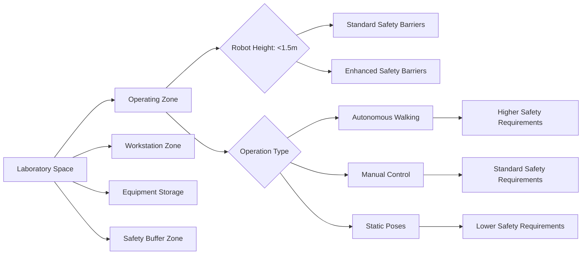

# Robot Lab Architecture

## Unitree Go2 and G1 humanoid platforms

Unitree Robotics has developed some of the most accessible and capable humanoid robots available today. Their Go2 and G1 platforms represent different approaches to humanoid robotics, each with specific use cases and capabilities.

### Unitree Go2 Platform

The Unitree Go2 is a compact quadruped robot that can serve as a platform for humanoid research through proxy experiments and gait development.

#### Technical Specifications

- **Weight**: 13.8 kg
- **Dimensions**: 530×277×300mm (L×W×H)
- **Maximum Speed**: 3.1 m/s
- **Maximum Load**: 10 kg
- **Battery Life**: 2+ hours
- **Actuators**: 12 high-performance actuators (3 per leg)
- **Sensors**: IMU, 2D LiDAR, RGB-D camera, depth camera
- **Processing**: Onboard computer with AI acceleration
- **Operating System**: ROS 2 compatible

#### Go2 Architecture

```yaml
# Unitree Go2 system architecture
hardware:
  actuators:
    count: 12  # 3 per leg
    type: "high-performance servos"
    torque: "variable by joint"
    position_control: true
    velocity_control: true
    torque_control: true
  
  sensors:
    - type: "IMU"
      purpose: "balance and orientation"
    - type: "2D LiDAR"
      purpose: "navigation and obstacle detection"
    - type: "RGB-D camera"
      purpose: "visual perception"
    - type: "depth camera"
      purpose: "3D perception"
    - type: "force/torque sensors"
      purpose: "ground contact detection"
  
  computing:
    cpu: "ARM-based processor"
    gpu: "AI acceleration unit"
    os: "real-time Linux"
    ros_compatibility: "ROS 2 Humble"
  
  power:
    battery_type: "Li-ion"
    capacity: "variable"
    runtime: "2+ hours"
    charging_time: "2-3 hours"

software:
  middleware: "ROS 2 Humble"
  perception: "computer vision, SLAM"
  control: "dynamic locomotion control"
  navigation: "path planning, obstacle avoidance"
  simulation: "Isaac Sim, Gazebo compatibility"
```

#### Go2 Applications in Humanoid Research

While Go2 is a quadruped, it can serve as a valuable platform for humanoid research:

1. **Locomotion Research**: Develop and test gait algorithms that can be adapted to bipedal systems
2. **Balance Control**: Study dynamic balance and control strategies
3. **Perception Systems**: Test computer vision and sensor fusion algorithms
4. **Navigation Algorithms**: Develop path planning and obstacle avoidance for complex terrains
5. **Proxy Experiments**: Conduct preliminary experiments before testing on bipedal platforms

### Unitree G1 Platform

The Unitree G1 represents Unitree's entry into the humanoid robotics market, offering a more affordable option for humanoid research and development.

#### Technical Specifications

- **Weight**: 35 kg
- **Height**: 1.2 m
- **Degrees of Freedom**: 23 (19 for legs, 2 for head, 2 for arms)
- **Maximum Walking Speed**: 1.2 m/s
- **Battery Life**: 2+ hours
- **Payload Capacity**: 5 kg
- **Actuators**: 23 high-performance actuators
- **Sensors**: IMU, cameras, force/torque sensors
- **Computing**: Integrated onboard computer
- **Connectivity**: WiFi, Ethernet, CAN bus

#### G1 Architecture

```yaml
# Unitree G1 system architecture
hardware:
  actuators:
    count: 23
    legs:
      count: 19
      hip_yaw_pitch: 2  # Combined joint
      hip_roll: 1
      hip_pitch: 1
      knee_pitch: 1
      ankle_pitch: 1
      ankle_roll: 1
      per_leg: 6
    head:
      count: 2
      yaw: 1
      pitch: 1
    arms:
      count: 2  # Simplified for G1
      configuration: "basic arm control"
  
  sensors:
    - type: "IMU"
      purpose: "full-body orientation and acceleration"
    - type: "force_torque_sensors"
      purpose: "foot contact detection, balance control"
      location: "both feet"
    - type: "cameras"
      purpose: "visual perception"
      count: 2  # Stereo vision
    - type: "depth_sensors"
      purpose: "3D perception"
      type: "RGB-D or LiDAR"
  
  computing:
    cpu: "high-performance ARM or x86"
    gpu: "integrated AI acceleration"
    os: "real-time Linux"
    ros_compatibility: "ROS 2 Humble"
  
  power:
    battery_type: "Li-ion"
    capacity: "sufficient for 2+ hours operation"
    management: "smart battery system"

software:
  middleware: "ROS 2 Humble"
  perception: "computer vision, depth perception"
  control: "bipedal locomotion, balance control"
  planning: "path planning, gait generation"
  simulation: "Isaac Sim, Gazebo compatibility"
  ai_framework: "PyTorch, TensorFlow support"
```

#### G1 Control Architecture

```python
# Example G1 control interface
import rclpy
from rclpy.node import Node
from sensor_msgs.msg import JointState
from geometry_msgs.msg import Twist
from std_msgs.msg import Float64MultiArray
import numpy as np

class G1Controller(Node):
    def __init__(self):
        super().__init__('g1_controller')
        
        # Joint state publisher and subscriber
        self.joint_state_sub = self.create_subscription(
            JointState, '/g1/joint_states', self.joint_state_callback, 10
        )
        
        self.joint_command_pub = self.create_publisher(
            JointState, '/g1/joint_commands', 10
        )
        
        # Velocity command subscriber
        self.velocity_sub = self.create_subscription(
            Twist, '/g1/cmd_vel', self.velocity_callback, 10
        )
        
        # Balance control publisher
        self.balance_command_pub = self.create_publisher(
            Float64MultiArray, '/g1/balance_cmd', 10
        )
        
        # Initialize joint positions and states
        self.joint_positions = {}
        self.joint_velocities = {}
        self.joint_efforts = {}
        
        # G1-specific joint names
        self.joint_names = [
            # Left leg
            'left_hip_yaw_pitch', 'left_hip_roll', 'left_hip_pitch',
            'left_knee_pitch', 'left_ankle_pitch', 'left_ankle_roll',
            # Right leg
            'right_hip_yaw_pitch', 'right_hip_roll', 'right_hip_pitch',
            'right_knee_pitch', 'right_ankle_pitch', 'right_ankle_roll',
            # Head
            'head_yaw', 'head_pitch',
            # Left arm (simplified)
            'left_shoulder_pitch', 'left_shoulder_roll',
            # Right arm (simplified)
            'right_shoulder_pitch', 'right_shoulder_roll',
            # Additional joints if available
        ]
        
        # Initialize with neutral positions
        for joint_name in self.joint_names:
            self.joint_positions[joint_name] = 0.0
            self.joint_velocities[joint_name] = 0.0
            self.joint_efforts[joint_name] = 0.0
        
        # Control parameters
        self.walking_speed = 0.5  # m/s
        self.max_turn_rate = 0.5  # rad/s
        self.balance_threshold = 0.1  # meters from center
        
        # Balance controller
        self.balance_controller = BalanceController()
        
        self.get_logger().info('G1 Controller initialized')
    
    def joint_state_callback(self, msg):
        """
        Update joint state information
        """
        for i, name in enumerate(msg.name):
            if i < len(msg.position):
                self.joint_positions[name] = msg.position[i]
            if i < len(msg.velocity):
                self.joint_velocities[name] = msg.velocity[i]
            if i < len(msg.effort):
                self.joint_efforts[name] = msg.effort[i]
    
    def velocity_callback(self, msg):
        """
        Handle velocity commands for walking
        """
        linear_x = msg.linear.x
        angular_z = msg.angular.z
        
        # Convert velocity to joint commands for walking
        joint_commands = self.velocity_to_joint_commands(linear_x, angular_z)
        
        # Publish joint commands
        joint_state_msg = JointState()
        joint_state_msg.header.stamp = self.get_clock().now().to_msg()
        joint_state_msg.name = list(joint_commands.keys())
        joint_state_msg.position = list(joint_commands.values())
        
        self.joint_command_publisher.publish(joint_state_msg)
    
    def velocity_to_joint_commands(self, linear_x, angular_z):
        """
        Convert velocity commands to joint positions for walking
        """
        commands = {}
        
        # Simplified walking pattern generation
        # In practice, this would use a more sophisticated gait generator
        current_time = self.get_clock().now().nanoseconds / 1e9
        
        # Generate walking gait based on desired velocity
        for joint_name in self.joint_names:
            if 'hip' in joint_name or 'knee' in joint_name or 'ankle' in joint_name:
                # Generate gait pattern for leg joints
                base_angle = 0.0
                if 'hip_pitch' in joint_name:
                    # Hip pitch pattern based on walking direction
                    base_angle = -0.1 if linear_x > 0 else 0.1 if linear_x < 0 else 0.0
                    # Add gait oscillation
                    gait_phase = current_time * 2 * np.pi * 0.5  # 0.5 Hz gait
                    oscillation = 0.05 * np.sin(gait_phase) if 'left' in joint_name else 0.05 * np.sin(gait_phase + np.pi)
                    commands[joint_name] = base_angle + oscillation
                elif 'knee' in joint_name:
                    # Knee pattern follows hip with phase offset
                    gait_phase = current_time * 2 * np.pi * 0.5
                    knee_pattern = 0.1 * np.sin(gait_phase + (np.pi if 'left' in joint_name else 0))
                    commands[joint_name] = knee_pattern
                elif 'ankle' in joint_name:
                    # Ankle adjustments for balance
                    commands[joint_name] = 0.05 * np.sin(current_time * 2 * np.pi * 1.0)
                else:
                    commands[joint_name] = self.joint_positions[joint_name]
            else:
                # Non-leg joints remain in current position
                commands[joint_name] = self.joint_positions[joint_name]
        
        return commands
    
    def balance_control_loop(self):
        """
        Main balance control loop
        """
        # Calculate center of mass position
        com_pos = self.calculate_center_of_mass()
        
        # Calculate zero moment point
        zmp_pos = self.calculate_zero_moment_point()
        
        # Generate balance corrections
        balance_corrections = self.balance_controller.calculate_corrections(
            com_pos, zmp_pos, self.joint_positions
        )
        
        # Apply balance corrections to joint commands
        balance_msg = Float64MultiArray()
        balance_msg.data = balance_corrections
        self.balance_command_publisher.publish(balance_msg)
    
    def calculate_center_of_mass(self):
        """
        Calculate center of mass based on joint positions
        This is a simplified implementation
        """
        # In a real implementation, this would use the robot's URDF and mass properties
        # For now, we'll return a placeholder
        return np.array([0.0, 0.0, 0.7])  # Approximate CoM at 70cm height
    
    def calculate_zero_moment_point(self):
        """
        Calculate zero moment point from force/torque sensors
        """
        # In a real implementation, this would read from foot force/torque sensors
        # For now, we'll return a placeholder
        return np.array([0.0, 0.0])  # ZMP at origin

class BalanceController:
    """
    Balance controller for humanoid robots
    """
    def __init__(self):
        # PID gains for balance control
        self.kp = 100.0  # Proportional gain
        self.ki = 10.0   # Integral gain
        self.kd = 50.0   # Derivative gain
        
        # Balance thresholds
        self.com_threshold = 0.05  # meters
        self.zmp_threshold = 0.03  # meters
        
        # History for integral and derivative terms
        self.com_error_history = []
        self.zmp_error_history = []
        self.max_history = 100
    
    def calculate_corrections(self, com_pos, zmp_pos, joint_positions):
        """
        Calculate balance corrections based on CoM and ZMP errors
        """
        # Calculate errors
        com_error = com_pos[:2]  # Horizontal CoM error
        zmp_error = zmp_pos  # ZMP error
        
        # Update error histories
        self.com_error_history.append(com_error)
        self.zmp_error_history.append(zmp_error)
        
        if len(self.com_error_history) > self.max_history:
            self.com_error_history.pop(0)
            self.zmp_error_history.pop(0)
        
        # Calculate PID terms for CoM
        com_proportional = self.kp * com_error
        com_integral = np.zeros(2)
        if len(self.com_error_history) > 1:
            com_integral = self.ki * np.sum(self.com_error_history, axis=0) * 0.01  # dt = 0.01s
        com_derivative = np.zeros(2)
        if len(self.com_error_history) > 2:
            com_derivative = self.kd * (self.com_error_history[-1] - self.com_error_history[-2]) / 0.01
        
        # Calculate PID terms for ZMP
        zmp_proportional = self.kp * zmp_error
        zmp_integral = 0.0
        if len(self.zmp_error_history) > 1:
            zmp_integral = self.ki * sum(self.zmp_error_history) * 0.01
        zmp_derivative = 0.0
        if len(self.zmp_error_history) > 2:
            zmp_derivative = self.kd * (self.zmp_error_history[-1] - self.zmp_error_history[-2]) / 0.01
        
        # Combine corrections
        total_correction = np.concatenate([
            com_proportional + com_integral + com_derivative,
            [zmp_proportional + zmp_integral + zmp_derivative]
        ])
        
        return total_correction.tolist()

def main(args=None):
    rclpy.init(args=args)
    
    controller = G1Controller()
    
    try:
        rclpy.spin(controller)
    except KeyboardInterrupt:
        controller.get_logger().info('Shutting down G1 Controller')
    finally:
        controller.destroy_node()
        rclpy.shutdown()
```

### Integration with Lab Infrastructure

Both Go2 and G1 platforms integrate well with standard robotics lab infrastructure:

#### ROS 2 Integration
- **Middleware**: Full ROS 2 compatibility for seamless integration
- **Standard Messages**: Uses standard ROS message types for sensors and control
- **Simulation Support**: Compatible with Gazebo and Isaac Sim for testing
- **Navigation Stack**: Works with standard ROS navigation packages

#### Networking and Communication
- **WiFi**: Standard wireless communication for remote operation
- **Ethernet**: Wired connection for high-bandwidth applications
- **CAN Bus**: Direct communication with actuators for low-latency control

#### Power Management
- **Battery Systems**: Smart battery management for extended operation
- **Charging Stations**: Automated charging capabilities
- **Power Monitoring**: Real-time power consumption tracking

## Robot arms as proxies

Robot arms serve as valuable proxies for humanoid manipulation research, allowing researchers to develop and test manipulation algorithms before implementing them on full humanoid systems.

### Types of Robot Arms for Research

#### Franka Emika Panda
- **Degrees of Freedom**: 7
- **Payload**: 3 kg
- **Reach**: 850 mm
- **Torque Control**: Full torque control for safe interaction
- **Sensors**: Joint torque sensors, camera in wrist
- **Applications**: Manipulation research, human-robot interaction

#### Universal Robots UR Series
- **Variants**: UR3, UR5, UR10 with different payloads and reaches
- **Payload**: 3-10 kg depending on model
- **Reach**: 500-1300 mm depending on model
- **Programming**: Easy to program with URScript
- **Applications**: Industrial manipulation, research, education

#### Kinova Gen3
- **Degrees of Freedom**: 7
- **Payload**: 1.2 kg
- **Reach**: 900 mm
- **Control**: Position, velocity, and torque control
- **Sensors**: Joint torque sensors, wrist camera
- **Applications**: Assistive robotics, manipulation research

### Proxy Research Applications

#### Manipulation Algorithm Development
Robot arms allow researchers to develop manipulation algorithms before transferring to humanoid platforms:

```python
import rclpy
from rclpy.node import Node
from trajectory_msgs.msg import JointTrajectory, JointTrajectoryPoint
from geometry_msgs.msg import PoseStamped
from sensor_msgs.msg import JointState
import numpy as np

class ManipulationProxyNode(Node):
    def __init__(self):
        super().__init__('manipulation_proxy_node')
        
        # Robot arm interface
        self.arm_command_pub = self.create_publisher(
            JointTrajectory, '/arm_controller/joint_trajectory', 10
        )
        
        self.arm_state_sub = self.create_subscription(
            JointState, '/arm_controller/joint_states', self.arm_state_callback, 10
        )
        
        # Target pose subscriber
        self.target_sub = self.create_subscription(
            PoseStamped, '/manipulation/target_pose', self.target_callback, 10
        )
        
        # Initialize arm state
        self.current_arm_joints = {}
        self.arm_joint_names = [
            'joint1', 'joint2', 'joint3', 'joint4', 
            'joint5', 'joint6', 'joint7'  # For 7-DOF arm
        ]
        
        # Inverse kinematics solver
        self.ik_solver = ProxyIKSolver()
        
        self.get_logger().info('Manipulation Proxy Node initialized')
    
    def arm_state_callback(self, msg):
        """
        Update arm joint state
        """
        for i, name in enumerate(msg.name):
            if i < len(msg.position):
                self.current_arm_joints[name] = msg.position[i]
    
    def target_callback(self, msg):
        """
        Handle manipulation target
        """
        # Solve inverse kinematics for target pose
        joint_goals = self.ik_solver.solve_ik(msg.pose)
        
        if joint_goals is not None:
            # Create trajectory message
            traj_msg = JointTrajectory()
            traj_msg.joint_names = self.arm_joint_names
            traj_msg.header.stamp = self.get_clock().now().to_msg()
            
            # Create trajectory point
            point = JointTrajectoryPoint()
            point.positions = joint_goals
            point.velocities = [0.0] * len(joint_goals)  # Start and end at zero velocity
            point.accelerations = [0.0] * len(joint_goals)
            point.time_from_start.sec = 2  # 2 seconds to reach goal
            point.time_from_start.nanosec = 0
            
            traj_msg.points.append(point)
            
            # Publish trajectory
            self.arm_command_publisher.publish(traj_msg)
    
    def execute_grasp_sequence(self, object_pose):
        """
        Execute a grasp sequence as a proxy for humanoid manipulation
        """
        # Pre-grasp position
        pre_grasp_pose = PoseStamped()
        pre_grasp_pose.header.frame_id = "base_link"
        pre_grasp_pose.pose = self.offset_pose(object_pose.pose, 0.1, "approach")  # 10cm from object
        
        # Grasp position
        grasp_pose = PoseStamped()
        grasp_pose.header.frame_id = "base_link"
        grasp_pose.pose = object_pose.pose  # At object position
        
        # Execute sequence
        self.move_to_pose(pre_grasp_pose.pose)
        self.approach_object(grasp_pose.pose)
        self.close_gripper()
        self.lift_object()
    
    def offset_pose(self, pose, distance, direction):
        """
        Offset a pose by a certain distance in a direction
        """
        # This would implement pose offsetting based on direction
        # For example, moving 10cm in the approach direction
        offset_pose = pose
        if direction == "approach":
            # Move along the approach direction (typically the z-axis of the gripper)
            offset_pose.position.x += distance * pose.orientation.z  # Simplified
        return offset_pose

class ProxyIKSolver:
    """
    Inverse kinematics solver for proxy research
    """
    def __init__(self):
        # Robot parameters (example for Franka Panda)
        self.dh_params = [
            {'a': 0, 'alpha': -np.pi/2, 'd': 0.333, 'theta_offset': 0},
            {'a': 0, 'alpha': np.pi/2, 'd': 0, 'theta_offset': 0},
            {'a': 0, 'alpha': np.pi/2, 'd': 0.316, 'theta_offset': 0},
            {'a': 0.0825, 'alpha': -np.pi/2, 'd': 0, 'theta_offset': 0},
            {'a': -0.0825, 'alpha': np.pi/2, 'd': 0.384, 'theta_offset': 0},
            {'a': 0, 'alpha': np.pi/2, 'd': 0, 'theta_offset': 0},
            {'a': 0.088, 'alpha': 0, 'd': 0.107, 'theta_offset': 0}
        ]
        
        # Joint limits
        self.joint_limits = {
            'min': [-2.8973, -1.7628, -2.8973, -3.0718, -2.8973, -0.0175, -2.8973],
            'max': [2.8973, 1.7628, 2.8973, -0.0698, 2.8973, 3.7525, 2.8973]
        }
    
    def solve_ik(self, target_pose, current_joints=None):
        """
        Solve inverse kinematics for target pose
        """
        # This would implement a full inverse kinematics solution
        # For this example, we'll return a simple approximation
        if current_joints is None:
            current_joints = [0.0] * 7  # Default joint positions
        
        # Use a numerical IK solver or analytical solution
        # For this example, we'll use a simplified approach
        try:
            # In practice, you'd use a proper IK library like KDL, MoveIt, or PyKDL
            # This is a placeholder implementation
            solution = self.numerical_ik_solve(target_pose, current_joints)
            return solution
        except Exception as e:
            self.get_logger().error(f'IK solution failed: {str(e)}')
            return None
    
    def numerical_ik_solve(self, target_pose, current_joints):
        """
        Numerical inverse kinematics solution using Jacobian transpose
        """
        # Initialize joint angles
        joints = np.array(current_joints, dtype=float)
        
        # Maximum iterations
        max_iterations = 1000
        tolerance = 1e-4
        
        for i in range(max_iterations):
            # Calculate forward kinematics
            current_pose = self.forward_kinematics(joints)
            
            # Calculate error
            pos_error = np.array([
                target_pose.position.x - current_pose.position.x,
                target_pose.position.y - current_pose.position.y,
                target_pose.position.z - current_pose.position.z
            ])
            
            # Calculate orientation error (simplified)
            # In practice, you'd use quaternion differences
            orient_error = np.array([
                target_pose.orientation.x - current_pose.orientation.x,
                target_pose.orientation.y - current_pose.orientation.y,
                target_pose.orientation.z - current_pose.orientation.z
            ])
            
            # Combine position and orientation errors
            total_error = np.concatenate([pos_error, orient_error])
            
            # Check if within tolerance
            if np.linalg.norm(total_error) < tolerance:
                return joints.tolist()
            
            # Calculate Jacobian
            jacobian = self.calculate_jacobian(joints)
            
            # Update joint angles using Jacobian transpose method
            joints_delta = 0.01 * np.dot(jacobian.T, total_error)
            joints += joints_delta
            
            # Apply joint limits
            joints = np.clip(joints, self.joint_limits['min'], self.joint_limits['max'])
        
        # Return best solution if no convergence
        return joints.tolist()
    
    def forward_kinematics(self, joints):
        """
        Calculate forward kinematics (simplified implementation)
        """
        # This would implement the full forward kinematics
        # For this example, return a placeholder pose
        from geometry_msgs.msg import Pose
        pose = Pose()
        pose.position.x = 0.5  # Placeholder
        pose.position.y = 0.0
        pose.position.z = 0.5
        pose.orientation.w = 1.0  # Identity orientation
        return pose
    
    def calculate_jacobian(self, joints):
        """
        Calculate the geometric Jacobian
        """
        # This would implement the full Jacobian calculation
        # For this example, return a placeholder 6x7 matrix
        return np.random.rand(6, 7) * 0.1  # Placeholder Jacobian

def main(args=None):
    rclpy.init(args=args)
    
    node = ManipulationProxyNode()
    
    try:
        rclpy.spin(node)
    except KeyboardInterrupt:
        node.get_logger().info('Shutting down Manipulation Proxy Node')
    finally:
        node.destroy_node()
        rclpy.shutdown()
```

### Transfer Learning from Arms to Humanoids

The knowledge gained from robot arm research can be transferred to humanoid systems:

#### Kinematic Mapping
- **Arm to Arm**: Direct mapping of arm manipulation strategies
- **Arm to Leg**: Using arm motion planning techniques for leg trajectory planning
- **Single to Dual**: Extending single-arm techniques to dual-arm or dual-leg systems

#### Control Strategy Transfer
- **Impedance Control**: From arm compliance to leg compliance for walking
- **Admittance Control**: From manipulation to whole-body compliance
- **Force Control**: From grasping to balance maintenance

#### Perception Integration
- **Object Detection**: From tabletop manipulation to environmental perception
- **Pose Estimation**: From object grasping to human pose estimation
- **Scene Understanding**: From manipulation workspace to navigation environment

## Mini humanoids (OP3, Hiwonder)

Mini humanoid robots provide cost-effective platforms for research and education, allowing experimentation with humanoid concepts at a smaller scale.

### ROBOTIS OP3 Platform

The ROBOTIS OP3 is a mid-sized humanoid robot designed for research and competition use.

#### Technical Specifications

- **Height**: 880 mm
- **Weight**: 9.8 kg
- **Degrees of Freedom**: 20
- **Actuators**: 20 DYNAMIXEL-X series servos
- **Processor**: Intel NUC i7
- **Sensors**: Stereo camera, IMU, 6-axis force sensors in feet
- **Battery**: 11.1V 2200mAh Li-Po
- **Communication**: WiFi, Ethernet, Bluetooth
- **Software**: ROS 2 compatibility

#### OP3 Architecture

```yaml
# ROBOTIS OP3 system architecture
hardware:
  actuators:
    count: 20
    head: 2  # Pan and tilt
    arms: 12  # 6 DOF per arm
    legs: 6   # 3 DOF per leg
    actuator_type: "DYNAMIXEL-X series"
    control_modes: ["position", "velocity", "current"]
  
  sensors:
    - type: "stereo_camera"
      resolution: "752x480"
      fps: 30
      purpose: "visual perception, localization"
    - type: "imu"
      type: "6-axis"
      purpose: "orientation, balance"
    - type: "force_torque_sensors"
      count: 4  # 2 per foot (heel/toe)
      purpose: "balance control, gait adaptation"
    - type: "microphone_array"
      count: 4
      purpose: "voice interaction, sound localization"
  
  computing:
    cpu: "Intel i7 NUC"
    ram: "8GB+"
    os: "Ubuntu 20.04/22.04"
    ros_compatibility: "ROS 2 Humble"
  
  power:
    battery: "11.1V 2200mAh Li-Po"
    runtime: "30-60 minutes"
    charging: "standard charger"

software:
  middleware: "ROS 2 Humble"
  frameworks:
    - "OpenCV"  # Computer vision
    - "PCL"     # Point cloud processing
    - "MoveIt"  # Motion planning
    - "navigation2"  # Navigation
  libraries:
    - "RH-P1013 SDK"  # DYNAMIXEL control
    - "robotis_math"  # Kinematics
    - "robotis_op3"   # OP3-specific packages
```

#### OP3 Control Implementation

```python
import rclpy
from rclpy.node import Node
from sensor_msgs.msg import JointState, Image
from geometry_msgs.msg import Twist
from std_msgs.msg import String
import cv2
from cv_bridge import CvBridge
import numpy as np

class OP3Controller(Node):
    def __init__(self):
        super().__init__('op3_controller')
        
        # Initialize CV bridge
        self.cv_bridge = CvBridge()
        
        # Publishers and subscribers
        self.joint_command_pub = self.create_publisher(
            JointState, '/op3/joint_commands', 10
        )
        
        self.joint_state_sub = self.create_subscription(
            JointState, '/op3/joint_states', self.joint_state_callback, 10
        )
        
        self.camera_sub = self.create_subscription(
            Image, '/op3/camera/image_raw', self.camera_callback, 10
        )
        
        self.cmd_vel_sub = self.create_subscription(
            Twist, '/op3/cmd_vel', self.cmd_vel_callback, 10
        )
        
        # Robot state
        self.current_joints = {}
        self.camera_image = None
        
        # Control parameters
        self.walking_pattern = {
            'step_size': 0.05,  # meters
            'step_height': 0.02,  # meters
            'step_duration': 0.5,  # seconds
            'balance_offset': 0.01  # meters
        }
        
        # Initialize with neutral positions
        self.initialize_joint_positions()
        
        self.get_logger().info('OP3 Controller initialized')
    
    def initialize_joint_positions(self):
        """
        Initialize joint positions to neutral stance
        """
        neutral_positions = {
            # Head
            'head_pan': 0.0,
            'head_tilt': 0.0,
            # Left arm
            'l_sho_pitch': 0.0,
            'l_sho_roll': 0.0,
            'l_el': -1.57,  # Elbow bent
            'l_wri_roll': 0.0,
            'l_wri_yaw': 0.0,
            'l_gripper': 0.0,
            # Right arm
            'r_sho_pitch': 0.0,
            'r_sho_roll': 0.0,
            'r_el': -1.57,  # Elbow bent
            'r_wri_roll': 0.0,
            'r_wri_yaw': 0.0,
            'r_gripper': 0.0,
            # Left leg
            'l_hip_roll': 0.0,
            'l_hip_yaw': 0.0,
            'l_hip_pitch': 0.0,
            'l_knee': 0.0,
            'l_ank_pitch': 0.0,
            'l_ank_roll': 0.0,
            # Right leg
            'r_hip_roll': 0.0,
            'r_hip_yaw': 0.0,
            'r_hip_pitch': 0.0,
            'r_knee': 0.0,
            'r_ank_pitch': 0.0,
            'r_ank_roll': 0.0
        }
        
        self.current_joints = neutral_positions
    
    def joint_state_callback(self, msg):
        """
        Update joint state information
        """
        for i, name in enumerate(msg.name):
            if i < len(msg.position):
                self.current_joints[name] = msg.position[i]
    
    def camera_callback(self, msg):
        """
        Process camera image for perception
        """
        try:
            self.camera_image = self.cv_bridge.imgmsg_to_cv2(msg, desired_encoding='bgr8')
            
            # Run simple perception (face detection as example)
            faces = self.detect_faces(self.camera_image)
            
            if faces:
                self.get_logger().info(f'Detected {len(faces)} faces')
                
                # If we want to track the largest face, for example
                if len(faces) > 0:
                    largest_face = max(faces, key=lambda f: f[2] * f[3])  # Largest by area
                    self.track_face(largest_face)
        
        except Exception as e:
            self.get_logger().error(f'Error processing camera image: {str(e)}')
    
    def detect_faces(self, image):
        """
        Detect faces in image using OpenCV
        """
        # Convert to grayscale
        gray = cv2.cvtColor(image, cv2.COLOR_BGR2GRAY)
        
        # Load face cascade classifier
        face_cascade = cv2.CascadeClassifier(cv2.data.haarcascades + 'haarcascade_frontalface_default.xml')
        
        # Detect faces
        faces = face_cascade.detectMultiScale(
            gray,
            scaleFactor=1.1,
            minNeighbors=5,
            minSize=(30, 30)
        )
        
        return faces
    
    def track_face(self, face_bbox):
        """
        Track a face by adjusting head position
        """
        x, y, w, h = face_bbox
        
        # Calculate face center relative to image center
        image_center_x = self.camera_image.shape[1] / 2
        image_center_y = self.camera_image.shape[0] / 2
        
        face_center_x = x + w / 2
        face_center_y = y + h / 2
        
        # Calculate errors
        x_error = face_center_x - image_center_x
        y_error = face_center_y - image_center_y
        
        # Convert to angular adjustments (simplified)
        pan_adjustment = x_error * 0.001  # Scaling factor
        tilt_adjustment = y_error * 0.001  # Scaling factor
        
        # Create head adjustment command
        joint_cmd = JointState()
        joint_cmd.header.stamp = self.get_clock().now().to_msg()
        joint_cmd.name = ['head_pan', 'head_tilt']
        joint_cmd.position = [
            self.current_joints.get('head_pan', 0) + pan_adjustment,
            self.current_joints.get('head_tilt', 0) + tilt_adjustment
        ]
        
        self.joint_command_publisher.publish(joint_cmd)
    
    def cmd_vel_callback(self, msg):
        """
        Handle velocity commands for walking
        """
        linear_x = msg.linear.x
        angular_z = msg.angular.z
        
        # Generate walking pattern based on velocity
        walking_joints = self.generate_walking_pattern(linear_x, angular_z)
        
        # Create joint command message
        joint_cmd = JointState()
        joint_cmd.header.stamp = self.get_clock().now().to_msg()
        joint_cmd.name = list(walking_joints.keys())
        joint_cmd.position = list(walking_joints.values())
        
        self.joint_command_publisher.publish(joint_cmd)
    
    def generate_walking_pattern(self, linear_x, angular_z):
        """
        Generate walking pattern based on velocity commands
        """
        current_time = self.get_clock().now().nanoseconds / 1e9
        walking_joints = self.current_joints.copy()
        
        # Simplified walking pattern generation
        # In practice, this would use a proper walking pattern generator
        step_phase = (current_time * 2 * np.pi * 0.5) % (2 * np.pi)  # 0.5 Hz walking
        
        # Apply walking gait to leg joints
        if abs(linear_x) > 0.01:  # If moving forward/backward
            # Left leg pattern
            walking_joints['l_hip_pitch'] = -0.1 + 0.1 * np.sin(step_phase)
            walking_joints['l_knee'] = 0.2 * np.sin(step_phase + np.pi/2)
            walking_joints['l_ank_pitch'] = 0.05 * np.sin(step_phase + np.pi)
            
            # Right leg pattern (opposite phase)
            walking_joints['r_hip_pitch'] = -0.1 + 0.1 * np.sin(step_phase + np.pi)
            walking_joints['r_knee'] = 0.2 * np.sin(step_phase + 3*np.pi/2)
            walking_joints['r_ank_pitch'] = 0.05 * np.sin(step_phase + 2*np.pi)
        
        # Apply turning pattern if angular velocity is significant
        if abs(angular_z) > 0.01:
            # Add turning gait to hip roll joints
            walking_joints['l_hip_roll'] = 0.05 * np.sin(step_phase) * np.sign(angular_z)
            walking_joints['r_hip_roll'] = 0.05 * np.sin(step_phase + np.pi) * np.sign(angular_z)
        
        return walking_joints

def main(args=None):
    rclpy.init(args=args)
    
    controller = OP3Controller()
    
    try:
        rclpy.spin(controller)
    except KeyboardInterrupt:
        controller.get_logger().info('Shutting down OP3 Controller')
    finally:
        controller.destroy_node()
        rclpy.shutdown()
```

### Hiwonder Platforms

Hiwonder offers several humanoid platforms suitable for education and research.

#### Hiwonder Hercules X1

- **Height**: 450 mm
- **Weight**: 3.2 kg
- **Degrees of Freedom**: 32
- **Actuators**: 32 high-torque servos
- **Processor**: Raspberry Pi 4 or Jetson Nano
- **Sensors**: Camera, microphone array, IMU
- **Programming**: Python, C++, ROS compatibility

#### Hiwonder Jetbot

- **Height**: 280 mm
- **Weight**: 1.5 kg
- **Degrees of Freedom**: 16 (bipedal configuration)
- **Actuators**: 16 smart servos
- **Processor**: Raspberry Pi 4
- **Sensors**: Camera, ultrasonic, IMU
- **AI Features**: Edge AI capabilities with Coral TPU

### Educational Applications

Mini humanoid robots are excellent for educational purposes:

#### Programming Education
- **Basic Programming**: Simple commands to move joints
- **Kinematics**: Understanding forward and inverse kinematics
- **Control Theory**: Learning feedback control and PID controllers
- **AI Integration**: Implementing perception and decision-making

#### Research Applications
- **Gait Development**: Testing walking algorithms at smaller scale
- **Human-Robot Interaction**: Studying interaction patterns
- **Learning Algorithms**: Reinforcement learning on physical systems
- **Multi-robot Systems**: Coordination between multiple small robots

## Lab setup and safety considerations

Setting up a humanoid robotics lab requires careful planning to ensure safety, efficiency, and proper functionality of all systems.

### Laboratory Layout Design

#### Space Requirements

For a humanoid robotics lab, consider the following space requirements:

- **Minimum Ceiling Height**: 3 meters (to accommodate tall robots and overhead equipment)
- **Clear Floor Space**: At least 4m x 4m for humanoid operation and safety margins
- **Operating Area**: Dedicated space for robot operation with safety barriers
- **Workstations**: Areas for programming and monitoring
- **Storage**: Secure storage for robots and equipment
- **Emergency Access**: Clear pathways for emergency access

#### Safety Zones



### Safety Equipment and Procedures

#### Physical Safety Measures

```yaml
# Lab safety equipment requirements
safety_equipment:
  barriers:
    type: "movable safety barriers"
    height: "1.2 meters"
    material: "flexible but sturdy"
    placement: "around operating area with 0.5m buffer"
  
  emergency_stop:
    count: 3
    placement: 
      - "operator station"
      - "remote pendant"
      - "wall-mounted panel"
    type: "hard-wired to power supply"
    response_time: "<100ms"
  
  padding:
    type: "industrial foam padding"
    thickness: "5cm"
    placement: "on all hard surfaces in operating area"
  
  lighting:
    type: "LED with consistent color temperature"
    brightness: "500+ lux"
    uniformity: "even distribution with no shadows"
  
  ventilation:
    type: "adequate airflow"
    purpose: "cooling for equipment, air circulation"
    emergency: "automatic shutoff if gas detected"
```

#### Electrical Safety

- **Ground Fault Circuit Interrupters (GFCIs)**: Required for all outlets
- **Uninterruptible Power Supply (UPS)**: For critical systems to prevent sudden shutdowns
- **Separate Circuits**: Dedicated circuits for high-power equipment
- **Lockout/Tagout Procedures**: For maintenance and repair

### Equipment Integration

#### Network Infrastructure

```yaml
# Network setup for humanoid robotics lab
network_infrastructure:
  wired_network:
    standard: "Cat6 or higher"
    topology: "star configuration"
    redundancy: "backup connection paths"
    bandwidth: "1Gbps minimum"
  
  wireless_network:
    standard: "Wi-Fi 6 (802.11ax)"
    frequency: "dual band (2.4GHz and 5GHz)"
    security: "WPA3"
    isolation: "separate VLAN for robots"
  
  real_time_requirements:
    latency: "<10ms for control commands"
    jitter: "<2ms"
    reliability: "99.9% uptime for critical systems"
  
  security:
    firewall: "enterprise-grade with deep packet inspection"
    segmentation: "isolated robot network"
    monitoring: "24/7 network monitoring"
```

#### Power Systems

- **Dedicated Circuits**: Separate electrical circuits for each robot to prevent interference
- **Power Conditioning**: Clean power with conditioning for sensitive electronics
- **Backup Power**: UPS systems for graceful shutdown during power outages
- **Remote Monitoring**: Power consumption monitoring for each robot

### Maintenance and Operations

#### Regular Maintenance Schedule

```markdown
## Weekly Maintenance
- [ ] Visual inspection of all robots for wear/damage
- [ ] Battery charge/discharge cycles verification
- [ ] Joint lubrication and calibration
- [ ] Sensor cleaning and verification
- [ ] Software backup

## Monthly Maintenance
- [ ] Detailed mechanical inspection
- [ ] Full calibration of all sensors
- [ ] Firmware updates
- [ ] Safety system testing
- [ ] Documentation update

## Quarterly Maintenance
- [ ] Deep cleaning of all systems
- [ ] Full system diagnostics
- [ ] Replacement of worn components
- [ ] Performance benchmarking
- [ ] Safety protocol review
```

#### Operational Procedures

```markdown
## Pre-Operation Checklist
- [ ] All safety equipment functional
- [ ] Operating area clear of obstacles
- [ ] Robot battery level adequate (>80%)
- [ ] All joints move freely
- [ ] Sensors calibrated
- [ ] Emergency stop accessible

## During Operation
- [ ] Operator remains attentive
- [ ] Maintain safe distance from moving parts
- [ ] Monitor for unusual sounds/vibrations
- [ ] Watch for overheating indicators
- [ ] Keep emergency stop within reach

## Post-Operation
- [ ] Robot returned to safe position
- [ ] Shutdown sequence completed properly
- [ ] Battery charged if needed
- [ ] Data backed up
- [ ] Area cleared and secured
```

## Conclusion

A well-designed humanoid robotics laboratory incorporates multiple platforms and systems to support research and development. From full-scale platforms like the Unitree G1 to proxy systems like robot arms and mini platforms like the ROBOTIS OP3, each serves specific research purposes. Proper lab architecture ensures safety while enabling effective experimentation with humanoid robotics technologies.

The integration of these diverse systems requires careful attention to networking, power, safety, and operational procedures. As humanoid robotics continues to advance, laboratories must evolve to support increasingly sophisticated research while maintaining the highest safety standards.